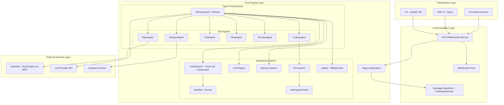
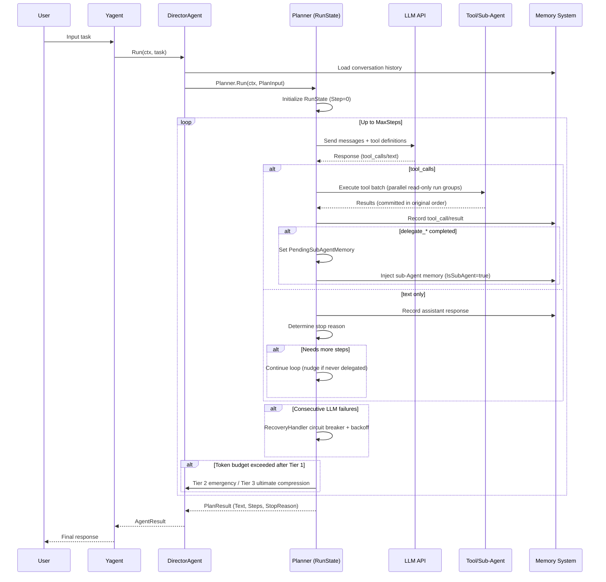
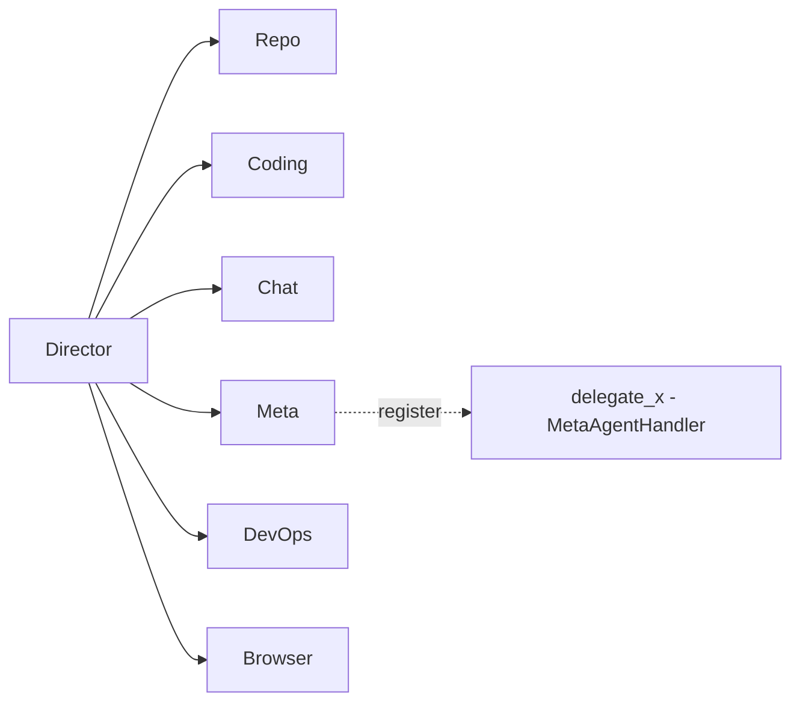
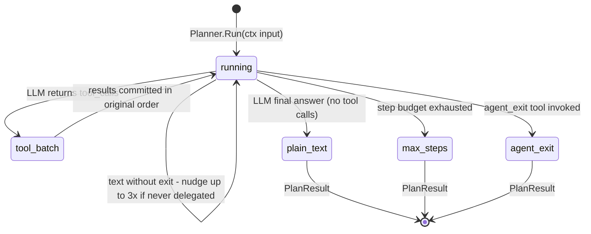
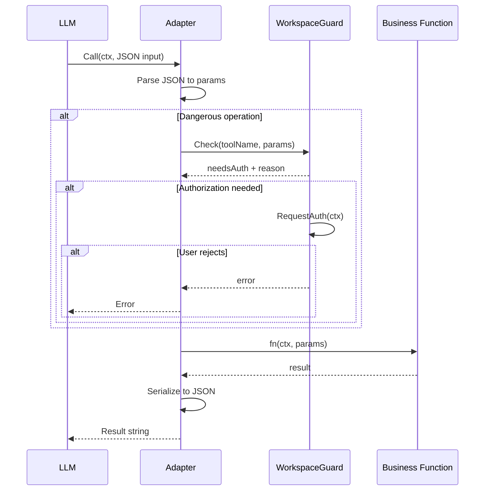
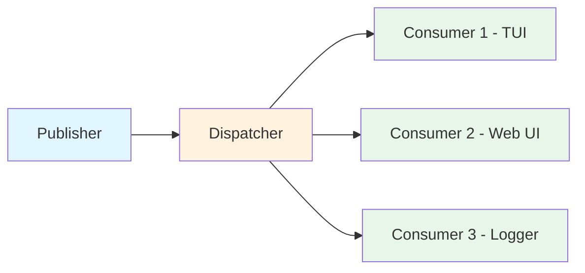
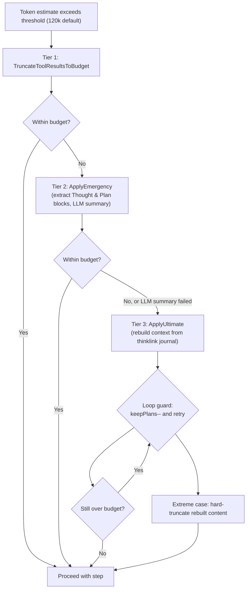
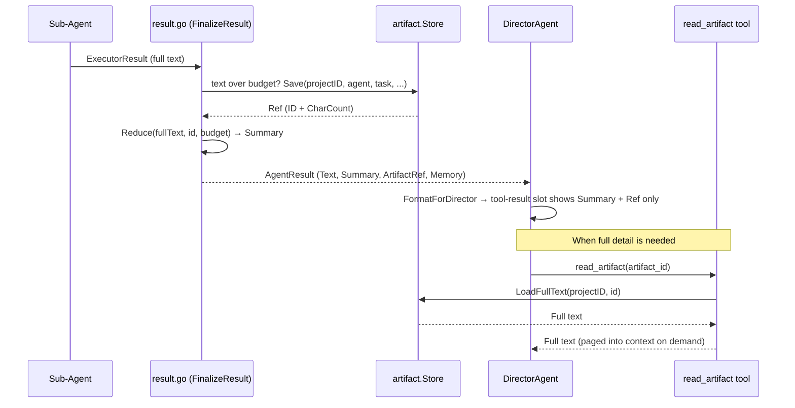
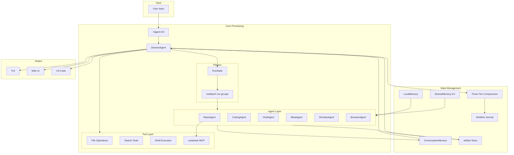
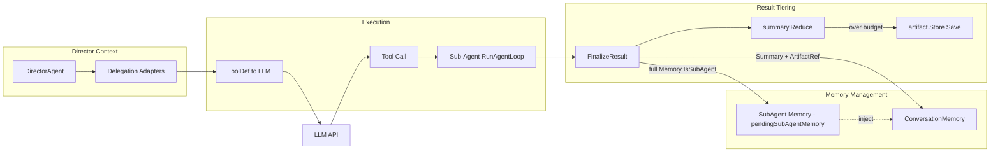

# Yagent System Architecture Document

> Version: v2.0.0 | Last Updated: 2025

## Table of Contents

- [1. Overview](#1-overview)
- [2. Overall Architecture Layers](#2-overall-architecture-layers)
- [3. Agent System](#3-agent-system)
  - [3.1 Agent Interface and Ports](#31-agent-interface-and-ports)
  - [3.2 DirectorAgent Orchestrator](#32-directoragent-orchestrator)
  - [3.3 Sub-Agent Details](#33-sub-agent-details)
  - [3.4 Delegation Model](#34-delegation-model)
  - [3.5 Planner State Machine](#35-planner-state-machine)
  - [3.6 Parallel Execution of Read-Only Tools](#36-parallel-execution-of-read-only-tools)
- [4. Tool System](#4-tool-system)
  - [4.1 Adapter Pattern](#41-adapter-pattern)
  - [4.2 Tool Registry](#42-tool-registry)
  - [4.3 WorkspaceGuard](#43-workspaceguard)
  - [4.4 Delegation Tools](#44-delegation-tools)
  - [4.5 Core Tool List](#45-core-tool-list)
- [5. LLM Engine](#5-llm-engine)
  - [5.1 Engine Interface](#51-engine-interface)
  - [5.2 Message and Tool Definition Format](#52-message-and-tool-definition-format)
  - [5.3 Multi-Model Support and Fallback](#53-multi-model-support-and-fallback)
- [6. Memory System](#6-memory-system)
  - [6.1 ConversationMemory](#61-conversationmemory)
  - [6.2 LocalMemory](#62-localmemory)
  - [6.3 SharedMemory](#63-sharedmemory)
  - [6.4 Rollout Recording](#64-rollout-recording)
  - [6.5 Knowledge Management](#65-knowledge-management)
- [7. Event/Message System](#7-eventmessage-system)
  - [7.1 Publish-Subscribe Architecture](#71-publish-subscribe-architecture)
  - [7.2 Event Types](#72-event-types)
  - [7.3 Subpackage Structure](#73-subpackage-structure)
- [8. Context Compression Engine](#8-context-compression-engine)
  - [8.1 Package Layout](#81-package-layout)
  - [8.2 Tier 1: Tool-Result Truncation](#82-tier-1-tool-result-truncation)
  - [8.3 Tier 2: Emergency Compression](#83-tier-2-emergency-compression)
  - [8.4 Tier 3: Ultimate Compression](#84-tier-3-ultimate-compression)
  - [8.5 Key Parameters and Hot Reload](#85-key-parameters-and-hot-reload)
- [9. Thinklink Journal](#9-thinklink-journal)
- [10. Artifact Store](#10-artifact-store)
- [11. External Service Integration](#11-external-service-integration)
  - [11.1 Codeseek Code Analysis Engine](#111-codeseek-code-analysis-engine)
  - [11.2 Browser Automation](#112-browser-automation)
- [12. Presentation Layer](#12-presentation-layer)
  - [12.1 TUI (Terminal UI)](#121-tui-terminal-ui)
  - [12.2 HTTP/WebSocket Service](#122-httpwebsocket-service)
  - [12.3 Web UI](#123-web-ui)
  - [12.4 VS Code Extension](#124-vs-code-extension)
- [13. Application Bootstrap](#13-application-bootstrap)
- [14. Configuration System](#14-configuration-system)
- [15. Key Design Patterns](#15-key-design-patterns)
- [16. Data Flow Diagrams](#16-data-flow-diagrams)
  - [16.1 Complete Task Processing Data Flow](#161-complete-task-processing-data-flow)
  - [16.2 Sub-Agent Result Tiering Data Flow](#162-sub-agent-result-tiering-data-flow)
- [17. Glossary](#17-glossary)
- [Appendix A. Key File Index](#appendix-a-key-file-index)
- [Appendix B. Configuration Example](#appendix-b-configuration-example)

---

## 1. Overview

Yagent is an **AI-driven autonomous coding system** built in Go. It employs a multi-Agent collaborative architecture, driven by LLMs (Large Language Models), capable of autonomously completing complex tasks such as code analysis, writing, debugging, and operations.

### Core Features

- **Multi-Agent Collaboration**: 6 specialized sub-Agents + 1 orchestrator, each with distinct responsibilities
- **Planner-Based Orchestration**: The Director's main loop is the `Planner` state machine (`RunState`) in the `director/` subpackage — a concrete, tested implementation, no longer a design plan
- **Rich Tooling**: 26 tool definitions in `tools.json` (634 lines, including `delegate_browser`) plus 5 more delegation tools built inline in the Director and 10 browser tools (`browser_*` prefix) in `internal/tools/browser/`
- **Read-Only Tool Parallelism**: Consecutive read-only tool calls within one step are grouped into run groups and executed concurrently (`toolbatch` package), driven by per-tool read-only metadata
- **Three-Tier Context Compression**: Tool-result truncation → emergency compression (LLM summarization of Thought & Plan blocks) → ultimate compression (context rebuild from the thinklink journal), implemented in the standalone `internal/compression/` package
- **Thinklink Journal**: A rolling journal of user inputs and Director Thought & Plan blocks that survives context resets and powers ultimate-compression rebuilds (`internal/thinklink/`)
- **Artifact Offloading**: Large sub-Agent outputs are tiered into a summary text plus an on-disk artifact reference (`internal/artifact/`), paged back on demand via the `read_artifact` tool
- **Memory Management**: Conversation memory + local sticky notes + shared KV memory, automatic tool_call pairing repair, rollout JSONL session recording
- **Safety Guards**: Workspace permission checks + tiered user confirmation mechanism
- **Knowledge Management**: Pre-conversation knowledge retrieval (via MCP), async memory consolidation, repo memory cache
- **Multiple Presentation Layers**: TUI, Web UI, VS Code extension, unified protocol

### Project Structure

```
yagent/
├── internal/
│   ├── agents/            # Agent system core
│   │   ├── activity/      # Delegate activity-aware idle/total timeout monitor
│   │   ├── director/      # Planner main loop, RunState, recovery, metrics,
│   │   │                  # Meta-Agent handler, project-context loader
│   │   ├── toolbatch/     # Read-only tool run-group planning + parallel execution
│   │   ├── director.go         # DirectorAgent orchestrator (delegation adapters, compression wiring)
│   │   ├── director_adapter.go # DirectorAdapter (metrics + recovery integration facade)
│   │   ├── executor.go         # RunAgentLoop tool-execution engine (ExecutorConfig)
│   │   ├── repo.go / coding.go / chat.go / meta.go / devops.go / browser_agent.go
│   │   ├── consolidation_worker.go # Async memory consolidation (single goroutine + channel)
│   │   ├── repo_memory.go      # Repo memory cache (SharedMemory-backed)
│   │   ├── result.go           # AgentResult finalization (summary + artifact wiring)
│   │   ├── read_artifact_tool.go # read_artifact tool (paged retrieval of offloaded results)
│   │   ├── ports.go            # Narrow per-consumer interfaces (ports & adapters)
│   │   ├── knowledge_hook.go   # Knowledge extraction hook
│   │   ├── git_checkpoint.go   # Git checkpoint mechanism
│   │   └── tools.json          # Tool definition manifest (26 tools)
│   ├── compression/       # Three-tier context compression (NEW in Phase 3-0)
│   ├── artifact/          # Sub-agent output offloading store (NEW)
│   ├── thinklink/         # Ultimate-compression journal (NEW)
│   ├── tools/             # Tool system (adapter, registry, workspace_guard, delegate helper)
│   │   └── browser/       # 10 browser tools (browser_* prefix)
│   ├── browser/           # Browser automation (BrowserManager, config, security)
│   ├── llm/               # LLM engine abstraction (engine_openai, engine_anthropic, fallback, netretry)
│   ├── memory/            # Memory system (ConversationMemory, LocalMemory, SharedMemory, Rollout)
│   ├── messaging/         # Message system (publisher, dispatcher)
│   │   └── consumers/     # TUIConsumer, WebSocketConsumer
│   ├── protocol/          # Protocol definitions (agent_events.go)
│   ├── config/            # Configuration system (defaults, hot_reload)
│   ├── datamanager/       # Task data persistence (DataManager, JSONL read/write/index)
│   ├── knowledge/         # Knowledge injector (KnowledgeInjector, pre-conversation retrieval)
│   ├── mcp/               # MCP client (MCPClient, stdio JSON-RPC)
│   ├── recovery/          # Circuit breaker (CircuitBreaker, closed/open/half-open)
│   ├── registry/          # Capability registry (CapabilityRegistry)
│   ├── skills/            # Skill system (SkillRegistry, loads .md skill files)
│   ├── dict/              # Dictionary/autocomplete engine (DictEngine)
│   ├── diff/              # Diff comparison utilities
│   ├── embedbin/          # Embedded binaries (codeseek engine)
│   ├── globalctx/         # Global context singleton (GlobalCtx, EnvView, RepoContextStore)
│   ├── logging/           # Task-scoped log directory management
│   ├── tokenutil/         # Token counting utilities
│   ├── util/              # Common utilities (crash, error_utils, numeric)
│   ├── app/               # Application bootstrap (Yagent.Init)
│   ├── tui/               # Terminal UI (common/, components/, layout/, anim/)
│   └── http/              # HTTP/WebSocket service
├── codeseek/              # Rust code analysis engine (source)
├── vscode/                # VS Code extension
├── webui/                 # Web frontend
├── protocol/              # Protocol Schema
└── config/                # Configuration files
```

> **Note (v2.0.0)**: Context compression is no longer part of the `agents` package. The former `context_compressor.go` / `emergency_compressor.go` files have been extracted into the standalone `internal/compression/` package (Phase 3-0), together with the new `internal/thinklink/` and `internal/artifact/` packages.

---

## 2. Overall Architecture Layers

Yagent adopts a classic four-layer architecture design, from top to bottom:



### Layer Descriptions

| Layer | Responsibility | Key Components |
|-------|----------------|----------------|
| **Presentation Layer** | User interaction interface | TUI, Web UI, VS Code Extension |
| **Communication Layer** | Inter-process communication, event distribution | HTTP Server, WebSocket, Message Dispatcher |
| **Core Engine Layer** | Business logic, AI reasoning | DirectorAgent/Planner, Sub-Agents, Tools, LLM, Memory, Compression, Thinklink, Artifact |
| **External Services Layer** | External capability integration | codeseek (MCP), LLM API, Headless Chrome |

---

## 3. Agent System

### 3.1 Agent Interface and Ports

All Agents in the system implement a unified `Agent` interface:

```go
// internal/agents/types.go
type Agent interface {
    Name() string
    Run(ctx context.Context, input string) (AgentResult, error)
}

type AgentResult struct {
    Text        string               // Full text output (programmatic consumption: output parsing,
                                     // consolidation, error messages). NOT injected into the
                                     // Director's LLM context.
    Summary     string               // Tiered summary (<500 tokens, for the Director's context;
                                     // equals full text when not truncated/offloaded)
    ArtifactRef *artifact.Ref        // On-disk reference to the full result (paged retrieval
                                     // via read_artifact); nil = not truncated/not offloaded
    Memory      []memory.ChatMessage // Sub-agent's full internal conversation history
                                     // (IsSubAgent=true; GroupID/ParentID filled by the Director)
}

type BaseAgent struct {
    LLM       llm.Engine
    Publisher EventBus
}
```

**Result Finalization** (`internal/agents/result.go`):

- `FinalizeResult(agentName, task, exec ExecutorResult)`: Builds an `AgentResult` from an `ExecutorResult`, generating the tiered `Summary` and — when the text exceeds the budget — an `ArtifactRef` via the artifact store's `summary.Reduce` (see 10). `FinalizeResultFull` is a variant for callers that need richer bookkeeping.
- `FormatForDirector(toolName, r AgentResult)`: Formats a result for injection into the Director's tool-result slot — summary text plus an artifact pointer, never the full offloaded text.
- `SetProjectPathProvider(fn)`: Wiring hook used for artifact project-ID computation.

**Design Highlights**:
- `Name()` returns the Agent's unique identifier (snake_case format)
- `Run()` accepts a task description string and returns the tiered result plus the complete internal conversation history
- `AgentResult.Memory` contains the full conversation records with `IsSubAgent=true`, which the Director injects into the main context

#### 3.1.1 Narrow Interfaces (Ports)

`internal/agents/ports.go` defines per-consumer narrow interfaces (a ports & adapters pattern). Each Agent constructor only declares the interfaces it actually needs; every port is naturally implemented by a concrete type (no adapter code required):

| Port | Implementor | Purpose |
|------|-------------|---------|
| `EventBus` | `*messaging.MessagePublisher` | Event publishing (Publish + PublishWithMetadata) |
| `PromptFormatter` | `*globalctx.GlobalCtx` | Appends environment/language/custom directives to system prompts |
| `Env` | `*globalctx.EnvView` | Dynamic runtime environment view (ProjectPath, FullYoloMode) |
| `RepoContextStore` | `*globalctx.RepoContextStore` | Repo summary cache — written by delegate_repo, read by coding/browser prompt builders |
| `KnowledgeProvider` | `*knowledge.KnowledgeInjector` | Pre-conversation knowledge retrieval/injection |
| `FileToolSet` | `*tools.FileOperationsTool` | read_file, list_dir, print_dir_tree, create_file, delete_file, rename_file |
| `SearchToolSet` | `*tools.SearchOperationsTool` | grep search |
| `SysToolSet` | `*tools.SystemOperationsTool` | run_bash |
| `EditToolSet` | `*tools.ReplaceBlockTool` | Block-replacement editing |
| `RepoToolSet` | `*tools.RepoOperationsTool` | semantic_search, code skeleton/snippet, call graph |
| `FlowToolSet` | `*tools.FlowControlTool` | `agent_exit`, `ask_user_for_help` |
| `Thinker` | `*tools.ThinkingTool` | Lightweight reasoning tool |
| `DeepThinker` | `*tools.DeepThinkingTool` | Deep analysis tool |
| `MicroAgentRunner` | `*tools.MicroAgentTool` | Isolated-context micro-agent sub-task runner |

> These ports decouple Agents from the `globalctx.GlobalCtx` mega-context. Note that `FlowToolSet` provides only flow-control tools (`agent_exit` / `ask_user_for_help`); the `delegate_*` tools are built separately by the DirectorAgent itself (see 4.4).

### 3.2 DirectorAgent Orchestrator

The **DirectorAgent** is the "brain" of the entire system, located at `internal/agents/director.go`, responsible for:

1. **Task Assessment**: Analyze user intent, select appropriate sub-Agent
2. **Delegation Scheduling**: Distribute tasks to sub-Agents via tool calls
3. **Result Aggregation**: Collect sub-Agent outputs, integrate into the final response
4. **Flow Control**: State management, retries, circuit breaking, context compression coordination

The Director's main loop is no longer inlined in `Run()`: the loop body lives in the **`Planner`** (`internal/agents/director/planner.go` + `planner_run.go`), per-step tool execution is provided by `RunAgentLoop` (`executor.go`) through the `directorToolRunner` adapter, and `Run()` is now a thin facade (`run()` → `Planner.Run()`).

#### 3.2.1 Director Structure (Grouped)

```go
type DirectorAgent struct {
    BaseAgent

    // ── Sub-Agent references ──
    RepoAgent    *RepoAgent
    CodingAgent  *CodingAgent
    ChatAgent    *ChatAgent
    MetaAgent    *MetaAgent
    DevOpsAgent  *DevOpsAgent
    BrowserAgent *BrowserAgent

    // ── Narrow interfaces / tool sets (ports.go, injected at construction) ──
    promptFmt   PromptFormatter
    env         Env
    files       FileToolSet
    search      SearchToolSet
    sys         SysToolSet
    edit        EditToolSet
    flow        FlowToolSet
    thinker     Thinker
    microAgent  MicroAgentRunner
    deepThinker DeepThinker

    // ── Safety & context ──
    guard     *tools.WorkspaceGuard
    repoCtx   RepoContextStore
    knowledge KnowledgeProvider
    mcpClient *mcp.MCPClient

    // ── Tool registration ──
    Adapters   []*tools.Adapter                // delegate_* + cognitive tools exposed to the LLM
    toolDefMap map[string]tools.ToolDefinition // tool name → definition from tools.json

    // ── Dynamic Agent registration & integration facets ──
    metaHandler      *director.MetaAgentHandler     // Meta-Agent designed custom agents (Phase 2d)
    adapter          *DirectorAdapter               // metrics + recovery integration facade
    llmClient        *llm.Client                    // runtime engine re-resolution
    projectCtxLoader *director.ProjectContextLoader // project context loading (Phase 2a, cached)

    // ── Memory & compression ──
    currentMemory          *memory.ConversationMemory   // active memory during Run
    pendingSubAgentMemory  *AgentResult                 // latest delegate result awaiting injection
    pendingSubAgentMu      sync.Mutex                   // guards pendingSubAgentMemory (concurrent delegates)
    injectSubAgentMemoryMu sync.Mutex                   // guards currentMemory appends from parallel delegates
    compressor             *compression.ContextCompressor // context compression orchestrator (Phase 3-0)

    // ── Timeouts & concurrency ──
    llmTimeout               time.Duration // single LLM call timeout (config [llm].timeout; default 5 min)
    delegateIdleTimeout      time.Duration // delegate activity-aware idle timeout
    delegateTotalTimeout     time.Duration // delegate total duration cap (0 = unlimited)
    maxParallelReadOnlyTools int           // max parallelism for read-only tool run groups

    // ── Misc ──
    EnhancedCommanderCfg config.EnhancedCommanderConfig
    thinkLink            *thinklink.Store       // ultimate-compression journal (same lifetime as Director)
    taskID               string
    // plus: maxSteps, metaRetryCount, customAgents (dynamic registration)
}
```

> **Note**: An outdated comment inside `director.go` says the LLM timeout "defaults to 3 minutes"; the effective code path (`defaults.go`: `[llm].timeout = 5 * time.Minute` and the `cfg.LLM.Timeout > 0 → else 5 min` fallback) makes **5 minutes** the real default. This document follows the effective code.

#### 3.2.2 Delegation Toolchain

Director exposes tools to the LLM through Adapters, with the core being 6 delegation tools plus the artifact retrieval tool:

| Tool Name | Target Agent | Purpose |
|-----------|-------------|---------|
| `delegate_repo` | RepoAgent | Code analysis, semantic search (marked read-only — safe inside parallel run groups) |
| `delegate_coding` | CodingAgent | File read/write, code editing |
| `delegate_chat` | ChatAgent | General conversation, explanations |
| `delegate_meta` | MetaAgent | Custom Agent generation (deny-listed from parallel groups) |
| `delegate_devops` | DevOpsAgent | System operations, Shell commands |
| `delegate_browser` | BrowserAgent | Browser automation |
| `read_artifact` | — | Paged retrieval of a previously offloaded AgentResult by artifact ID |

#### 3.2.3 Director Run Flow



#### 3.2.4 Fault Tolerance Mechanisms

LLM failure-handling state has been lifted out of DirectorAgent into `director.RecoveryHandler` (`internal/agents/director/recovery.go`), accessed through the `DirectorAdapter` facade:

```go
// internal/agents/director/recovery.go
type RecoveryConfig struct {
    MaxRetries                 int           // step retry count
    LLMRetries                 int           // LLM step-level retries (from config [llm].step_retries)
    CircuitBreakerThreshold    int           // 0 = disabled
    CircuitBreakerResetTimeout time.Duration // breaker reset window
}

type RecoveryHandler struct {
    config       RecoveryConfig
    breaker      *recovery.CircuitBreaker // closed/open/half-open (internal/recovery)
    stepFailures map[string]int           // stepID → failure count
    consecutiveLLMFailures int            // not reset on success (legacy semantics preserved)
    lastLLMFailureTime     time.Time
}
```

- **Circuit Breaker**: When consecutive LLM call failures reach `CircuitBreakerThreshold`, `IsCircuitBreakerOpen()` gates the main loop; recovery follows the half-open pattern (`internal/recovery/circuit_breaker.go`)
- **Step Retries**: Invalid LLM responses retry the current step via `RetryWithBackoff` / `ComputeBackoff` (exponential backoff); retry count from `config.LLM.StepRetries`
- **Transient Failure Detection**: `IsLLMFailureTransient(err)` classifies retryable network/rate-limit errors
- **tool_call Pairing Repair**: `validateAndRepairToolCallPairs` (Director side) and `repairToolCallPairsAfterTruncation` (memory side) automatically restore mismatched tool_call / tool_response pairs after truncation or compression

#### 3.2.5 DirectorAdapter (Integration Facade)

`internal/agents/director_adapter.go` is the facade gluing the Director to the extracted `director/` subpackage components (Phase 2/3 refactorings):

```go
type DirectorAdapter struct {
    metrics  *director.MetricsCollector  // LLM durations, tool-call counts, error tallies
    recovery *director.RecoveryHandler   // retries + circuit-breaker state
}
```

Methods: `RecordLLMDuration`, `RecordLLMSuccess` / `RecordLLMFailure` / `RecordLLMFailureStats`, `IsCircuitBreakerOpen`, `LLMRetries`, `ConsecutiveLLMFailures`. The DirectorAgent holds it as `adapter *DirectorAdapter`, alongside `llmClient *llm.Client` for per-agent/per-tool engine re-resolution at runtime. Companion components in the `director/` subpackage:

- `metrics.go` — `MetricsCollector`: task/tool-call counts, per-source error tallies, LLM durations, `Snapshot()`
- `recovery.go` — `RecoveryHandler` (above)
- `project_context.go` — `ProjectContextLoader`: loads project-context files once per session (cached internally), plus `ComputeProjectID`

### 3.3 Sub-Agent Details

| Agent | File | Core Tool Set | Notes |
|-------|------|---------------|-------|
| **RepoAgent** | `repo.go` | semantic_search, query_code_skeleton, query_code_snippet, find_function_callee/caller, query_call_graph, read_file, search_by_regex | Calls codeseek via MCP; places the system prompt in a Human role message (`SystemAsHuman`) to benefit from prompt caching; writes the `repoCtx` summary |
| **CodingAgent** | `coding.go` | create_file, search_replace_in_file, delete_file, rename_file, run_bash, thinking, micro_agent, deepthinking | Receives `repoCtx` in its system prompt; owns the Git-checkpoint config |
| **ChatAgent** | `chat.go` | thinking, micro_agent, deepthinking | No file-operation permissions; pure conversation Agent |
| **MetaAgent** | `meta.go` | thinking | Single LLM call generates a JSON agent design; registered via MetaAgentHandler and immediately executed |
| **DevOpsAgent** | `devops.go` | run_bash, read_file, search_by_regex, file operations | System administration, log analysis, ad-hoc shell |
| **BrowserAgent** | `browser_agent.go` | browser_* tools (11) | Drives BrowserManager (go-rod, headless Chrome) |

#### MetaAgent Output Format

```json
{
  "thinking": "...",
  "agent_name": "my_custom_agent",
  "agent_design": "System prompt...",
  "tools_used": ["read_file", "search_by_regex"],
  "task_for_agent": "Task description template..."
}
```

The JSON design is parsed by `director.MetaAgentHandler.ParseMetaAgentOutput` / `ExtractJSONObject` (retrying up to `metaRetryCount` times on parse failure), registered as a permanent `delegate_<name>` tool, and immediately executed to complete the current task.

### 3.4 Delegation Model

> **Note (v2.0.0)**: Earlier revisions described a static `DelegationGraph` DAG with DFS cycle detection and Kahn topological sorting. That design no longer exists in the codebase. Delegation is now defined **purely by the set of delegate tools exposed by the Director** and guarded by the **RunState counters** of the Planner state machine (3.5). No `DelegationGraph` type, DFS verification, or topological sort remains.



**Delegation sources**:

1. **Six built-in delegate tools** — created inline in `NewDirectorAgent()` as `tools.NewAdapter("delegate_repo", ...)` etc. (see 4.4). Each closure runs the target sub-Agent through `executeCustomAgent` / `applyEnhancedCommander` and routes results via `takePendingSubAgentMemory` for memory injection.
2. **Dynamic delegate tools** — designed by the MetaAgent and registered through `director.MetaAgentHandler.Register()` / `DirectorAgent.registerCustomAgent()`; they become permanent `delegate_<name>` tools for the remainder of the process lifetime.

**Delegation lifecycle & timeouts** (`internal/agents/activity/`): every delegate invocation runs under an activity-aware idle-timeout monitor:

- `WithIdleTimeout(ctx, Options)` creates a monitored context; tool starts, LLM completions, and explicit `Heartbeat(ctx, detail)` calls refresh the last-activity timestamp (poll interval defaults to 1s)
- Idle limit: explicit `config.Agent.DelegateIdleTimeout` if set, otherwise derived as `max(10 min, llmTimeout + 5 min)`; a total-duration cap via `DelegateTotalTimeout` (0 = unlimited)
- Cancellation surfaces as `IdleTimeoutError` / `TotalTimeoutError`, both carrying the actual idle/elapsed duration, the last activity kind (e.g. `tool:start:run_bash`), and its age for diagnostics

**Anti-floundering guard**: if the LLM finishes steps without ever delegating, the Planner injects a forced "delegate now" reminder up to `maxNonDelegationPrompts = 3` times (`RunState.NonDelegationPrompts`); `DelegationAttempts` tracks every delegate attempt (success or failure).

### 3.5 Planner State Machine

The Director's main-loop state is now a concrete implementation (previously documented as a "design plan"):

```go
// internal/agents/director/planner.go
type RunState struct {
    Step                  int   // current main-loop step
    MaxSteps              int   // step budget (former a.maxSteps)
    HasDelegated          bool  // whether a delegate tool ran during this task
    NonDelegationPrompts  int   // forced-reminder injections so far (cap 3)
    DelegationAttempts    int   // delegate attempts (success or failure)
    PendingSubAgentMemory *memory.SubAgentMemory
    mu sync.Mutex // guards the counters on concurrent ToolRunner.Call paths
}

func (s *RunState) RecordDelegation(ok bool)
func (s *RunState) SetPendingSubAgentMemory(m *memory.SubAgentMemory)
```

The main loop is `Planner.Run(ctx, PlanInput) (PlanResult, error)` in `director/planner_run.go`, wired through `PlannerConfig`:

- **Injected clients**: `LLM LLMClient`, `Publisher EventPublisher`, `Journal ThinklinkStore`, `Rollout *memory.RolloutWriter`, `Tools ToolRunner`, `Prompts PromptBuilder` (all nil-tolerant)
- **Compression**: `Compressor *compression.ContextCompressor` plus `CompressEnable`, `CompressThreshold`, `CompressKeepTokens`, `UltimateCompressEnable`, `UltimateCompressKeepPlans`
- **Recovery / Metrics**: `Recovery *RecoveryHandler`, `Metrics *MetricsCollector` (same-package types)
- **Closure injections**: `NormalizeMessages` (tool_call pairing repair), `EstimateTokensFn`, `ConvertToolCallsFn` — the `director` subpackage may not import the `agents` package, so legacy helpers are injected as function fields
- **Scheduling**: `MaxParallelReadOnlyTools` (normalized upstream by `agents.NormalizeMaxParallelReadOnlyTools`) and `IsParallelizableTool` predicate; `ToolTimeout` (default 120s — `delegate_*` uses a dedicated 10-minute timeout applied by the facade)
- `LLMTimeout`: single LLM call timeout (former `a.llmTimeout`, default 5 min)

**Stop reasons** (`PlanResult.StopReason`): `agent_exit` (explicit exit tool), `plain_text` (LLM finished with a text answer), `max_steps` (step budget exhausted).



### 3.6 Parallel Execution of Read-Only Tools

Within a single Planner/Executor step, consecutive tool calls that are **read-only and side-effect-free** are batched into a "run group" and executed concurrently — a scheduling mechanism introduced since this document's previous revision.

**Planning** (`internal/agents/toolbatch/plan.go`):

```go
type Segment struct {
    Parallel bool   // whether this segment may run concurrently
    Indices  []int  // indices of the elements in this run group
}

// Splits [0, total) into maximal run groups: a maximal span of consecutive
// parallelizable indices forms one Parallel segment; non-parallelizable
// elements remain single-element serial segments.
func Plan(total int, isParallelizable func(i int) bool) []Segment
```

**Execution** (`internal/agents/toolbatch/run.go`):

```go
// Runs one segment. Parallel segments fan out across at most `parallel`
// goroutines (each wrapped in panic recovery via guardedExec); serial
// segments run one at a time. onCommit fires exactly once per element,
// in ORIGINAL index order, after results are in — keeping memory appends,
// events, and rollout accounting deterministic regardless of completion
// order.
func Run[T any](ctx context.Context, seg Segment, parallel int,
    exec func(ctx context.Context, i int) T,
    onCommit func(i int, res T))
```

**Parallelizability predicate**: a tool participates in a parallel run group only if its `Adapter.IsReadOnly()` is true (see 4.1), it is not interactive, and it is not deny-listed. The deny-list currently contains `agent_exit` (stop semantics) and `delegate_meta` (registry side effects) — these always execute in place, serially. Among the built-in delegate tools only `delegate_repo` is marked read-only (`WithReadOnly(true)`); `delegate_coding/devops/browser/meta` are not, since coding writes files, devops runs processes, and browser/meta have session-wide side effects. Parallelism is capped by `MaxParallelReadOnlyTools`: 0/negative → default 4, 1 → strict serial kill-switch (bit-for-bit legacy behavior), upper-clamped to 8.

**Concurrency-safety notes** (from source comments): parallel delegate closures race on `pendingSubAgentMemory` and on `currentMemory` appends; both are guarded (`pendingSubAgentMu`, `injectSubAgentMemoryMu`), and the "latest write wins" / completion-order accounting semantics match the serial era.

---

## 4. Tool System

The tool system, located at `internal/tools/`, provides a unified, secure tool invocation interface.

### 4.1 Adapter Pattern

**Adapter** is the core abstraction of the tool system, wrapping functions into LLM-consumable tool definitions:

```go
// internal/tools/adapter.go
type ToolFunc func(ctx context.Context, params map[string]interface{}) (interface{}, error)

type Adapter struct {
    name        string
    description string
    fn          ToolFunc
    schema      map[string]interface{}
    guard       *WorkspaceGuard
    readOnly    bool // read-only / side-effect-free metadata: this tool modifies no
                     // shared state (files, processes); safe inside parallel run groups
}
```

**Key Methods**:
- `NewAdapter(name, description, fn)`: Create adapter
- `WithSchema(schema)`: Set JSON Schema (chained option)
- `WithReadOnly(enabled)`: Explicitly set the read-only metadata (zero value false; marking a side-effectful tool as read-only is a bug)
- `WithReadOnlyIfKnown()`: Auto-mark by tool-name whitelist — called at the `tools.json` batch-registration point
- `IsReadOnly()`: Query the metadata (used by the toolbatch scheduler)
- `Call(ctx, input)`: Execute the tool call, automatically triggering guard checks
- `ToToolDef()`: Convert to the LLM's `ToolDef` format

**Workflow**:


### 4.2 Tool Registry

**Registry** is a thread-safe tool registry supporting registration/lookup/listing:

```go
// internal/tools/registry.go
type Registry struct {
    adapters map[string]*Adapter
    mu       sync.RWMutex
    hash     string // tool-list hash (cache-consistency detection)
    dirty    bool   // hash needs recomputation
}
```

**API**: `Register(*Adapter)`, `Execute(ctx, name, params)`, `List()` — plus cheap change detection: registering a tool sets `dirty`, and the memoized tool-list `hash` lets the system-prompt layer notice "tool set changed" without diffing names.

**Features**:
- Thread-safe (read-write lock)
- Indexed by name
- Batch retrieval (for LLM system prompts)
- Memoized tool-list hash for cache-consistency checks

### 4.3 WorkspaceGuard

**WorkspaceGuard** checks dangerous operations before execution, ensuring operations stay within the workspace:

```go
// internal/tools/workspace_guard.go
type WorkspaceGuard struct {
    workspacePath     string
    confirmMgr        *UserConfirmManager
    sessionAllowed    map[string]bool // tools granted session-wide authorization
    sessionAllAllowed bool            // all tools authorized for this session
    projectAuthorized bool            // project permanent authorization (from settings.json)
    yoloMode          bool            // skip all authorization checks
}
```

**Dangerous Tool List** (unchanged in v2.0.0):
| Tool Name | Check Type |
|-----------|------------|
| `create_file` | Path within workspace |
| `search_replace_in_file` | Path within workspace |
| `delete_file` | Path within workspace |
| `rename_file` | Path within workspace |
| `run_bash` | Command check |

**Authorization Levels** (evaluated top-down on every dangerous call):

| Priority | Level | Effect |
|----------|-------|--------|
| 1 | **YOLO mode** | Skip all authorization checks |
| 2 | **Project permanent authorization** (`allow_all_project`) | Persisted to settings.json; skip all |
| 3 | **Session all-authorization** (`allow_all_session`) | All tools authorized for the session |
| 4 | **Session per-tool authorization** (`allow_session`) | That tool authorized for the session |
| 5 | **First call** | `RequestAuth(ctx)` blocks until the user approves or denies |

### 4.4 Delegation Tools

> **Note (v2.0.0)**: `internal/tools/delegate.go` still exists — it defines the `AgentRunner` interface (`Run(ctx, task) (string, error)`), a `NewDelegateAdapter` builder, and a `DelegateFunc` adapter — but currently has **no call sites**. It remains as a generic helper.

The six built-in `delegate_<agent>` tools are constructed **inline in `NewDirectorAgent()`** as ordinary `tools.NewAdapter` instances whose closures run the target sub-Agent (through `executeCustomAgent` / `applyEnhancedCommander`, each with its own tool registry, step budget, LLM engine, and delegate timeout). Inline construction is what enables per-tool details such as `delegate_repo.WithReadOnly(true)`:

```go
// internal/agents/director.go (abridged)
delegateRepo := tools.NewAdapter("delegate_repo", "Delegate analysis task to Repo-Agent",
    func(ctx, params) {...}).WithReadOnly(true)
delegateCoding := tools.NewAdapter("delegate_coding", "Delegate coding task to Coding-Agent",
    func(ctx, params) {...})
// ... delegate_chat, delegate_devops, delegate_browser, delegate_meta
```

Custom agents designed by the MetaAgent are registered by `DirectorAgent.registerCustomAgent(ca *CustomAgent)`, which creates an additional `delegate_<name>` adapter and adds it to the live Adapters list and `toolDefMap`.

### 4.5 Core Tool List

**26 tool definitions** live in `internal/agents/tools.json` (634 lines), including `delegate_browser` (the only delegate defined in the manifest). Five more delegation tools are registered in code (inline in the Director), the `read_artifact` tool in `read_artifact_tool.go`, and 10 browser tools in `internal/tools/browser/`.

| Category | Tool | Description |
|----------|------|-------------|
| **File Operations** | `read_file` | Read file content |
| | `create_file` | Create new file |
| | `search_replace_in_file` | Search and replace text block |
| | `delete_file` | Delete file |
| | `rename_file` | Rename file |
| **Directory Browsing** | `list_dir` | View directory contents |
| | `print_dir_tree` | Print directory tree |
| **Search / Analysis** | `search_by_regex` | Regular expression search |
| | `semantic_search` | Semantic code search (calls codeseek) |
| | `query_code_skeleton` | Get code skeleton |
| | `query_code_snippet` | Get code snippet |
| | `find_function_callee` | Find functions called by a function |
| | `find_function_caller` | Find functions that call a function |
| | `query_call_graph` | Query call graph |
| **System** | `run_bash` | Execute Shell commands |
| **Cognitive** | `thinking` | Lightweight thinking tool |
| | `micro_agent` | Isolated-context micro-agent sub-task |
| | `deepthinking` | Deep analysis (truncation-exempt in Tier 1) |
| **Interaction** | `ask_user_for_help` | Request user help (confirm/select/input) |
| | `agent_exit` | Exit the Agent loop |
| **Git** | `git_checkpoint_list` | List checkpoints |
| | `git_checkpoint_create` | Create checkpoint |
| | `git_checkpoint_rollback` | Roll back to checkpoint |
| **Knowledge** | `consolidate_knowledge` | Consolidate knowledge |
| | `prune_history` | Prune historical knowledge |
| **Artifact** | `read_artifact` (registered in code) | Paged retrieval of an offloaded sub-Agent output by ID |
| **Delegation** (registered in code) | `delegate_repo` | Delegate code analysis |
| | `delegate_coding` | Delegate coding task |
| | `delegate_chat` | Delegate conversation |
| | `delegate_meta` | Delegate Agent design |
| | `delegate_devops` | Delegate operations task |
| | `delegate_browser` | Delegate browser operations (the only delegate defined in tools.json) |
| **Browser** (`internal/tools/browser/`, 10 tools) | `browser_navigate`, `browser_click`, `browser_scroll`, `browser_input`, `browser_cookies`, `browser_evaluate`, `browser_extract`, `browser_history`, `browser_pdf`, `browser_wait_element` | Headless browser automation (all `browser_` prefixed; `registry.go` is the registration entry) |

---

## 5. LLM Engine

### 5.1 Engine Interface

LLM engine abstraction layer, supporting multiple LLM providers:

```go
// internal/llm/engine.go
type Engine interface {
    GenerateContent(ctx context.Context, messages []Message, tools []ToolDef, opts *CallOptions) (*Response, error)
    Model() string
}
```

**Implementations**:
| File | Implementation | Notes |
|------|----------------|-------|
| `engine_openai.go` | `EngineOpenAI` | OpenAI-compatible interface (works for Claude/Gemini via compatible endpoints); passes `ReasoningEffort` through shared parameters |
| `engine_anthropic.go` | `EngineAnthropic` | Anthropic native interface; supports thinking blocks, cache control, `ReasoningEffort` overrides |
| `fallback.go` | `FallbackEngine` | Weight-ordered provider failover (see 5.3) |
| `llm.go` | `Client` | Client facade: engine construction, per-agent/per-tool engine resolution |
| `netretry.go` | — | Transient network-error classification for retries |
| `messages.go` | — | Message hygiene helpers: `NormalizeMessages`, `MergeConsecutiveAssistants`, `repairToolCallPairs`, `dropEmptyMessages`, `ensureValidStart` |

### 5.2 Message and Tool Definition Format

#### Message Format

```go
// internal/llm/engine.go
type Message struct {
    Role       Role       // system/user/assistant/tool
    Content    string     // Text content
    ToolCalls  []ToolCall // Tool calls (assistant role)
    ToolCallID string     // Tool call ID (tool role responses)
    ToolName   string     // Tool name
    Reasoning  string     // Thinking/reasoning content (DeepSeek and similar models)

    IsAnchored       bool              // Anchor flag: true = this message is NEVER compressed
    TruncationMarker *TruncationMarker // Records that a tool result was truncated
}

type TruncationMarker struct {
    ToolName       string // e.g. "run_bash", "read_file"
    OriginalLen    int    // original content length (bytes)
    OmittedLen     int    // omitted bytes
    TruncationPass int    // 0 = first truncation, 1+ = re-truncation
}

type CallOptions struct {
    MaxTokens       int
    Temperature     float64
    StreamHandler   StreamHandler
    ReasoningEffort string // per-call override; non-empty ("high"/"max") enables
                           // DeepSeek thinking mode
}
```

#### Tool Definition

```go
type ToolDef struct {
    Type     string      // "function"
    Function FunctionDef
}

type FunctionDef struct {
    Name        string         // Tool name
    Description string         // Tool description
    Parameters  map[string]any // JSON Schema
}
```

`TokenUsage` additionally tracks provider-specific cache token accounting (`CacheCreationInputTokens`, `CacheReadInputTokens`, `TotalInputTokens`) for cache-hit-rate metrics across OpenAI (cache included in `prompt_tokens`) and Anthropic (cache excluded from `input_tokens`).

### 5.3 Multi-Model Support and Fallback

Yagent supports configuring different LLM models for different Agents and tools:

```
Configuration hierarchy:
  1. per-agent engine (highest priority)
  2. per-tool engine
  3. default engine
```

```go
// Engine resolution
directorEngine   = client.GetAgentEngine("director")
codingEngine     = client.GetAgentEngine("coding")
microAgentEngine = client.GetToolEngine("micro_agent")
```

Engines are re-resolvable at runtime: the Director keeps `llmClient *llm.Client` and calls `refreshSubAgentEngines()` when hot-reloaded configuration changes provider mappings (`config.SetToolProvider`, provider config lookup).

**Fallback chain** (`internal/llm/fallback.go`): when the primary engine fails, fallback providers are tried in `FallbackProvider.Weight` **descending** order (`sort.SliceStable` on weight). Every fallback attempt is capped by the same timeout/retry settings.

**Advantages**:
- Use low-cost models for simple tasks
- Use high-quality models for complex reasoning
- Micro-Agents can use an independent model

---

## 6. Memory System

### 6.1 ConversationMemory

Manages the complete conversation context, supporting multi-role and sub-Agent grouping:

```go
// internal/memory/memory.go
type ChatMessage struct {
    Type       MessageType     // system/human/assistant/tool
    Content    string
    ToolCalls  []ToolCallData
    ToolCallID *string
    Timestamp  time.Time
    Metadata   map[string]interface{}
    IsAnchored bool            // anchor flag: never dropped by truncation

    // Sub-Agent grouping metadata
    GroupID    string  // Shared by the same sub-agent call
    ParentID   string  // Points to the Director's tool_call_id
    IsSubAgent bool    // Quick filter flag
}

type ConversationMemory struct {
    Messages []ChatMessage
    MaxSize  int // Default 300 messages
}
```

**Core Features**:
1. **Automatic Truncation**: When exceeding MaxSize, removes the oldest non-system messages
2. **tool_call Pairing Repair**: `repairToolCallPairsAfterTruncation` automatically repairs mismatched tool_calls after truncation
3. **Sub-Agent Isolation**: `ToMessages()` automatically skips `IsSubAgent` messages
4. **Sub-agent Injection**: After a sub-Agent completes, the Director injects its full memory into the main context

### 6.2 LocalMemory

Agent-private message memory, not shared across Agents:

```go
// internal/memory/local.go
type LocalMemory struct {
    agentID  string              // owner agent identifier
    messages []ChatMessage       // private message history
    maxSize  int                 // max message count (default 200)
    mu       sync.RWMutex
    metadata map[string]interface{}
}
```

**API**: `AddMessage`, `GetMessages`, `GetContext`, `Clear`, `Size`, `FilterByType`, `Trim(keepLast)`, `ToLLMMessages`, metadata `Set/Get`.

**Usage**:
- Agent-internal state tracking
- Task context caching
- Avoiding redundant LLM calls

### 6.3 SharedMemory

Cross-agent shared memory with KV persistence and subscriptions (`internal/memory/shared.go`):

```go
type SharedMemory struct {
    messages    []ChatMessage
    maxSize     int      // default 500 (constructed with 100 in app bootstrap)
    subscribers []func(ChatMessage)
    // KV store for simple key-value persistence
    kv  map[string]string
    // Optional periodic persistence
    persistPath string
    ...
}
```

**API**: `AddMessage` / `Publish`, `GetMessages`, `GetContext`, `Subscribe(fn) -> unsubscribe`, `FilterByAgent`, KV operations (`SetKey/GetKey/DeleteKey/HasKey`), and `EnablePersistence(interval, filePath)` which spawns a periodic save ticker (plus `MarkDirty`, `Close`).

**Usage**: `RepoMemoryStore` (6.5) persists its cache into a SharedMemory KV store.

### 6.4 Rollout Recording

Every task can be recorded as a Codex-compatible Rollout JSONL file (`internal/memory/rollout_writer.go`, `rollout_types.go`, `rollout_convert.go`):

- `RolloutWriter` streams JSONL events to disk under the task's logging directory; a writer is created per task (`DirectorAgent.createRolloutWriter`)
- Injected into the Planner through `PlannerConfig.Rollout` and into tool execution via `memory.WithRolloutWriter(ctx, w)` / `GetRolloutWriter(ctx)`
- `rollout_convert.go` maps LLM messages/events into rollout record types; `rollout_types.go` defines the wire format

### 6.5 Knowledge Management

#### KnowledgeInjector

**Responsibility**: Retrieve relevant knowledge from the codebase before Agent conversation execution and inject it into the context.

**Location**: `internal/knowledge/injector.go` (~315 lines)

```go
type InjectionContext struct {
    UserMessage string   // current user input / task description
    TargetFiles []string // optional target file paths
    AgentName   string   // triggering agent (for log correlation)
    Domains     []string // knowledge domains to search (repo / coding); empty = all
}

type KnowledgeInjector struct {
    mcpClient *mcp.MCPClient
    cfg       config.KnowledgeConfig
    publisher EventPublisher // fail-safe event publishing (injection summary)
}
```

**Workflow**:
1. `BuildQuery(injCtx)` constructs the retrieval query
2. Retrieve relevant code snippets and knowledge entries via `mcpClient.KnowledgeSearch()` (codeseek MCP)
3. Filter by `InjectionMinScore` (default **0.3**)
4. `FormatKnowledgeBlock` formats the injection block, bounded by `InjectionMaxTokens`
5. Publish an injection-summary event (`context_loaded`)

> **Status note**: `Inject()` currently short-circuits (`disabled := true`) — knowledge loading/injection is temporarily hard-disabled pending re-enablement (TODO in source). The injector API and configuration remain in place.

#### ConsolidationWorker

**Responsibility**: Asynchronously consolidate conversation memory generated during Agent execution, extracting reusable knowledge.

**Location**: `internal/agents/consolidation_worker.go` (still in the `agents` package; a Phase 4-0 TODO plans extraction into `internal/memory/`)

**Design**: A single background goroutine consumes consolidation requests from a buffered channel (`channelBufferSize = 16`), processing them strictly serially — no unbounded goroutine fan-out.

**Workflow**:
1. Listen for Agent execution-completion signals (consolidation tasks)
2. Summarize and extract knowledge from conversation history (via LLM)
3. Write extracted knowledge into the repo memory store for later retrieval
4. Supports hot-reload configuration

#### RepoMemoryStore

**Responsibility**: Cache repository-level structured memory to avoid re-analyzing the same code areas.

**Location**: `internal/agents/repo_memory.go`

```go
type RepoMemoryStore struct {
    repoID string              // derived project ID
    shared *memory.SharedMemory // underlying KV + persistence
    mu     sync.RWMutex
    cache  string               // cached repo summary
    loaded bool
}
```

**Workflow**:
1. Cache code-analysis results (structure, dependencies, key functions) as KV entries in SharedMemory
2. Quickly retrieve existing memory during Agent execution
3. Works with KnowledgeHook (`knowledge_hook.go`) to extract new knowledge points during conversations

---

## 7. Event/Message System

### 7.1 Publish-Subscribe Architecture



**Core Components**:

```go
// MessagePublisher - thin publisher wrapper (internal/messaging/message_publisher.go)
type MessagePublisher struct {
    dispatcher *MessageDispatcher
}
func (p *MessagePublisher) Publish(eventType string, content interface{}, from string) error
func (p *MessagePublisher) PublishWithMetadata(eventType string, content interface{}, from string, metadata map[string]interface{}) error

// MessageDispatcher - per-consumer dispatch (internal/messaging/message_dispatcher.go)
type MessageDispatcher struct {
    mu      sync.RWMutex
    entries []*dispatcherEntry // one dispatch unit per consumer
    stopped atomic.Bool
    perConsumerBuf    int // per-consumer queue capacity (default 1000)
    defaultMaxRetries int // default 3
}

// Single consumer's dispatch unit: filter set + dedicated event queue + critical bypass
type dispatcherEntry struct {
    id     string
    types  map[EventType]struct{} // nil/empty = subscribe to all
    ch     chan *Event            // normal events (non-blocking send, drop on full)
    critMu sync.Mutex
    crit   []*Event               // critical-event bypass (FIFO, never dropped; cap 4096)
    wake   chan struct{}          // cap=1, bypass wake signal
    dropped atomic.Int64          // dropped-event counter
    lastWarn atomic.Int64         // drop-warning rate limiter
}
```

**Data Flow**:
1. Agents publish events via the Publisher (`Publish` / `PublishWithMetadata`)
2. The Dispatcher matches the event type against each consumer's filter set and pushes into that consumer's **dedicated queue**
3. **Normal events** are non-blocking; when a consumer's queue is full the event is dropped and counted (drop-warning rate limited to ≤1/s per consumer)
4. **Critical events** — the user-interaction loop (`user_help_needed` / `user_help_response`) — bypass the queue entirely (mutex + slice FIFO, defensive cap 4096 with drop-oldest) and are **never dropped**
5. Ordering: FIFO within a consumer per class (normal/critical); no ordering guarantees across classes or consumers
6. Lifecycle: event channels are never closed (concurrent sends would panic); shutdown drains via the `stopped` flag instead

### 7.2 Event Types

Protocols are defined in `internal/protocol/agent_events.go` (383 lines, generated by `protoc-gen-yagent`):

| Event Type | Description | Use Case |
|------------|-------------|----------|
| `model_info` | Model information | Broadcast current model at startup |
| `llm_call_start` | LLM call start | Monitoring/timing |
| `llm_call_end` | LLM call end | Monitoring/statistics |
| `ai_response` | AI response | Display to user |
| `tool_call_start` | Tool call start | Progress display |
| `tool_call_result` | Tool call result | Progress display |
| `tool_call_error` | Tool call error | Error handling |
| `context_loaded` | Context loaded | Progress display |
| `commit_context_loaded` | Commit-learner context loaded | NEW: commit knowledge loading progress |
| `ai_stream_start` | Streaming response start | Streaming UI |
| `ai_chunk` | Streaming data chunk | Streaming UI |
| `ai_stream_end` | Streaming response end | Streaming UI |
| `user_help_needed` | User help needed | Permission request (critical bypass) |
| `user_help_response` | User response | Permission decision (critical bypass) |
| `conversation_error` | Conversation error | Error handling |
| `conversation_result` | Conversation completed | Task completion |
| `status_update` | Status update | NEW: coarse status transitions |
| `thinking` | Thinking content | Thinking display |
| `task_complete` | Task complete | NEW: terminal task signal |

Each event type ships with a typed payload struct (e.g. `ToolCallStartData`, `CommitContextLoadedData`), plus the `InteractionType` enum (`confirm` / `select` / `input`) used by `ask_user_for_help`.

### 7.3 Subpackage Structure

The messaging system now includes one subpackage:

| Subpackage | Contents | Description |
|------------|----------|-------------|
| `internal/messaging/consumers/` | `tui.go`, `websock.go` | TUI consumer, WebSocket consumer |

Core files: `message_publisher.go`, `message_dispatcher.go`, `message_consumer.go`, `message_event.go`.

> **Note (v2.0.0)**: The former `bus/` and `peer/` subpackages no longer exist; channel-based distribution and peer-to-peer messaging have been removed and consolidated into `MessageDispatcher` + `MessagePublisher`.

---

## 8. Context Compression Engine

### 8.1 Package Layout

Context compression is implemented in the standalone `internal/compression/` package (extracted from the former `agents/context_compressor.go` and `agents/emergency_compressor.go` in Phase 3-0):

| File | Contents |
|------|----------|
| `compressor.go` | `ContextCompressor` orchestrator: `ShouldCompress`, `ApplyEmergency`, `ApplyUltimate`; `UltimateCompressionStats` |
| `emergency.go` | `EmergencyCompressMessages`, `ExtractThoughtAndPlanBlocks`, `summarizeBlocksWithLLM`, `EmergencyCompressionStats`, tier-2 constants |
| `priority.go` | `toolTruncationPriority(toolName) int` — per-tool truncation priority |
| `truncate.go` | `TruncateToTokenBudget(content, keepTokens)`, `EstimateMessagesTokens(messages)` |
| `truncate_results.go` | `TruncateToolResultsToBudget(messages, maxTokens, keepTokens)`, `ContextCompressionStats`, `TruncatedToolInfo`, tier-1 constants |
| `compressor_test.go`, `context_compressor_test.go`, `emergency_compressor_test.go` | Unit + regression tests |

**The orchestrator**:

```go
type ContextCompressor struct {
    engine               llm.Engine      // LLM summarization engine (tier 2)
    agentName            string          // agent name (for LLM summaries and logs)
    thinkLink            ThinkLinkStore  // narrow thinklink interface (tier 3 rebuild source)
    clearPendingSubAgent func()          // optional hook: clear pending sub-agent memory on reset
}

func NewContextCompressor(engine llm.Engine, agentName string,
    thinkLink ThinkLinkStore, clearPendingSubAgent func()) *ContextCompressor

func (c *ContextCompressor) ShouldCompress(messages []llm.Message, threshold int) bool
func (c *ContextCompressor) ApplyEmergency(ctx context.Context, messages []llm.Message,
    threshold int, mem *memory.ConversationMemory) ([]llm.Message, *EmergencyCompressionStats)
func (c *ContextCompressor) ApplyUltimate(messages []llm.Message, threshold int,
    mem *memory.ConversationMemory, keepPlansLimit int) ([]llm.Message, *UltimateCompressionStats)
```

The Director owns one `ContextCompressor` (`compressor` field), built via `NewContextCompressor` with the same `thinklink.Store` instance it journals into — journal writes from the Planner and rebuild reads during compression see identical data.

**Three-tier pipeline**:



### 8.2 Tier 1: Tool-Result Truncation

`TruncateToolResultsToBudget(messages, maxTokens, keepTokens)` brings the message list under the token budget by truncating the payloads of past tool results — the least valuable long-lived content:

- **Priority order** (`toolTruncationPriority`): priority **0** tools (bulk-output operations such as `create_file`) are truncated first; priority **1** next; priority **-1** tools (e.g. `deepthinking`) are **never truncated**
- Each truncated tool result keeps `keepTokens` tokens (default `DefaultToolResultKeepTokens = 200`), via `TruncateToTokenBudget`
- Truncated messages are tagged with a `TruncationMarker` (tool name, original/omitted lengths, truncation pass count) so the budget logic is idempotent across repeated passes
- Returns aggregate `ContextCompressionStats`: original/compressed/saved tokens, saved percentage, per-truncation records (tool name, kept/omitted tokens)

This tier runs in the Planner main loop before every LLM call whenever the estimated token count exceeds the threshold; it does not touch system/user/assistant messages or anchored messages.

### 8.3 Tier 2: Emergency Compression

When truncation alone is insufficient, `ApplyEmergency` restructures the conversation around the Director's Thought & Plan blocks:

1. **Extract** all `Thought & Plan` blocks from assistant messages (`ExtractThoughtAndPlanBlocks`)
2. **Summarize**: if there are enough blocks, `summarizeBlocksWithLLM` asks the LLM for a compact digest — input capped at 20,000 tokens (`emergencySummaryInputTokens`), output capped at 2,000 tokens (`emergencySummaryMaxTokens`); falls back to deterministic concatenation if the LLM is unavailable
3. **Keep recent**: the last `DefaultEmergencyCompressKeepLastN = 3` Thought & Plan blocks are preserved verbatim
4. **Replace**: memory is overwritten with a single user message containing the original task input, the summary block, and the kept Thought & Plan blocks

`EmergencyCompressionStats` records original/compressed/saved tokens, extracted vs. summarized vs. kept block counts, whether the LLM was used, and the reason. The `clearPendingSubAgent` hook is invoked so a mid-flight sub-agent result is not injected into the reset memory.

### 8.4 Tier 3: Ultimate Compression

When both previous tiers are insufficient (or keep failing/flopping), `ApplyUltimate` rebuilds the context from the **thinklink journal** (9) — the journal of all user inputs and Thought & Plan blocks recorded in real time:

1. `thinkLink.RebuildPrompt(keepPlans)` generates a fresh user message: a reset notice at top, the full list of user inputs (last one marked `[CURRENT TASK]`), and the Thought & Plan blocks in chronological order (`[TP-n]` labels)
2. **Loop protection**: the rebuild keeps at most `keepPlans` Thought & Plan blocks; if the rebuilt context still exceeds the budget, `keepPlans--` and rebuild again — progressively sacrificing older planning detail
3. **Extreme fallback**: if even a single Thought & Plan block cannot fit, the rebuilt content is hard-truncated (`Truncated: true` in the stats)

`UltimateCompressionStats` records original/compressed/saved tokens, total journal blocks, retained `KeptPlans`, retained user inputs, and whether hard truncation fired. The memory is then overwritten with an anchored reset user message, and summarization of the journal can continue in subsequent steps. The number of retained blocks can be pre-capped through `UltimateKeepPlans` / `UltimateCompressionKeepPlans` configuration (0 = keep all).

### 8.5 Key Parameters and Hot Reload

| Parameter | Default | Layer | Meaning |
|-----------|---------|-------|---------|
| `DefaultContextCompressionThreshold` | 120,000 | Tier 1+ | Token estimate that triggers compression |
| `DefaultToolResultKeepTokens` | 200 | Tier 1 | Tokens kept per truncated tool result |
| `DefaultEmergencyCompressKeepLastN` | 3 | Tier 2 | Recent Thought & Plan blocks preserved verbatim |
| `emergencySummaryInputTokens` | 20,000 | Tier 2 | Max input tokens for the LLM summary |
| `emergencySummaryMaxTokens` | 2,000 | Tier 2 | Max output tokens for the LLM summary |
| `DefaultMaxEntries` (thinklink) | 200 | Tier 3 | Journal entry capacity (eviction: oldest first, first user input anchored) |
| `MaxParallelReadOnlyTools` | 4 (clamped ≤8) | Scheduling | Read-only run-group parallelism (kill-switch at 1) |

**Wiring** (`ExecutorConfig` / `PlannerConfig`): compression is opt-in per caller — `EnableContextCompression`, `ContextCompressionThreshold`, `ToolResultKeepTokens`, `UltimateThinkLink compression.ThinkLinkJournal` (nil disables tier 3), and `UltimateKeepPlans`. The Director forwards these from `config.EnhancedCommanderConfig`.

**Hot reload** (`internal/config/hot_reload.go`): configuration changes are applied at runtime. `EnhancedCommanderConfig` carries `Enable`, `EnableContextCompression`, `ContextCompressionThreshold`, `ToolResultKeepTokens`, `EnableUltimateCompression` (default **true**), `UltimateCompressionKeepPlans`, and `MaxParallelReadOnlyTools`. Changing the threshold or keep-budget takes effect on the next planner step; structural changes (e.g. engine/provider mapping) trigger engine re-resolution via the Director's `llmClient` / `refreshSubAgentEngines()`.

---

## 9. Thinklink Journal

`internal/thinklink/` implements the ultimate-compression support store — a rolling journal that records the raw user inputs and the Director's Thought & Plan blocks in real time, so the conversation can be **rebuilt from scratch** after Tier 3 compression or a context reset.

### 9.1 Data Model

```go
// internal/thinklink/thinklink.go
type Kind int
const (
    KindUserInput   Kind = iota // user's original inputs
    KindThoughtPlan             // Director's "## Thought & Plan" blocks
)

type Entry struct {
    ID        string    // entry ID (timestamp + sequence)
    Kind      Kind      // entry kind
    Content   string    // verbatim content
    Timestamp time.Time // recording time
    Step      int       // Director's step number at recording time (0 if n/a)
}

type Store struct {
    mu         sync.RWMutex
    entries    []Entry
    idSeq      uint64
    maxEntries int // capacity cap (entry count); oldest-first eviction
}

func NewStore(maxEntries int) *Store                          // maxEntries <= 0 → DefaultMaxEntries (200)
func (s *Store) AddUserInput(content string, step int) (Entry, bool)
func (s *Store) AddThoughtPlan(content string, step int) (Entry, bool)
func (s *Store) Snapshot() []Entry                            // thread-safe copy
func (s *Store) Len() int
func (s *Store) Count(kind Kind) int
func (s *Store) RebuildPrompt(keepPlans int) string
```

### 9.2 Mechanism

- **Append-only journaling**: the Planner records every user input (`AddUserInput`) and every emitted Thought & Plan block (`AddThoughtPlan`) together with the current step number; entries are append-only — nothing is rewritten
- **Capacity management**: beyond the entry cap (default 200) the oldest entries are evicted, **except the very first `KindUserInput`, which is never evicted** (the original task intent must never be lost)
- **`RebuildPrompt(keepPlans)`** renders the rebuilt context as a single user message:
  - A top note explaining that the context was reset by ultimate compression
  - All recorded user inputs in order, the last one annotated `[CURRENT TASK]`
  - All (or up to `keepPlans`) Thought & Plan blocks in chronological order, numbered `[TP-n]` with timestamps
  - `keepPlans <= 0` keeps every block

### 9.3 Integration

- **Producer**: the Director/Planner journal into the store live during the main loop (via the `ThinkLinkStore` narrow interface; `PlannerConfig.Journal`)
- **Consumer**: `ContextCompressor.ApplyUltimate` calls `RebuildPrompt` through the `ThinkLinkStore` read interface (`ThinkLinkJournal` in `executor.go`)
- **Single source of truth**: `DirectorAgent.thinkLink` and the `ContextCompressor.thinkLink` field reference the **same** `*thinklink.Store` instance — there is exactly one journal per Director, with the same lifetime as the Director itself (accumulating across tasks)
- **TUI visibility**: the journal can be inspected in the Terminal via the thinklink fullscreen component (`tui_thinklink_fullscreen.go`)

---

## 10. Artifact Store

`internal/artifact/` implements sub-Agent output tiering: when a sub-Agent's full result text is too large to inject into the Director's context, it is written to disk as an **artifact**, and only a compact summary plus a reference is returned.

### 10.1 Data Model

```go
// internal/artifact/store.go
type Ref struct {
    ID        string // "{YYYYMMDD}-{HHmmss}-{8 hex}", e.g. "20260219-120000-3fa9c2d1"
    CharCount int    // full-text rune count
}

type Artifact struct {
    SchemaVersion int    `json:"schema_version"` // always 1
    ID            string `json:"id"`
    Agent         string `json:"agent"`
    Task          string `json:"task"`
    ProjectID     string `json:"project_id"`
    Summary       string `json:"summary"`
    FullText      string `json:"full_text"`
    CharCount     int    `json:"char_count"` // full-text rune count
    CreatedAt     string `json:"created_at"` // RFC3339
}

type Store struct {
    root string // artifact root directory
}
```

### 10.2 Persistence

- **Location**: `~/.yagent/data/artifacts/{projectID}/{id}.json` (overridable via the `YAGENT_ARTIFACT_ROOT` environment variable; `DefaultStore()` applies the default)
- **Atomic writes**: the file is written as `{id}.json.tmp` first, then `os.Rename`d into place — readers never see partial artifacts
- **API**: `Save(projectID, agent, task, summary, fullText) (Ref, error)`, `UpdateSummary(projectID, id, summary)`, `Load(projectID, id) (Artifact, error)`, `LoadFullText(projectID, id) (string, error)`
- **ID generation**: `newArtifactID()` produces the timestamp + random-hex ID; `ComputeProjectID(projectPath)` (in the director subpackage) derives the per-project directory

### 10.3 Summary Generation (artifact/summary.go)

`Reduce(fullText, id string, budgetTokens int) (summary, truncated)`:
- Estimates the token count (`EstTokens`) and, when the text fits the budget, returns the full text as the summary with `truncated=false`
- Otherwise it shortens the text and appends a pointer to the artifact (by ID), with `truncated=true`
- `Disabled()` reports whether artifact tiering is switched off (then summaries always contain the full text)

### 10.4 Integration



- `AgentResult.ArtifactRef *artifact.Ref` (`internal/agents/types.go`) is nil whenever the output was small enough to keep inline
- The Director exposes the `read_artifact` tool (registered from `read_artifact_tool.go`), so the LLM can pull back the full text of any artifact when needed
- Memory: nothing here is conversation memory; artifacts are addressed purely by `(projectID, id)`

---

## 11. External Service Integration

### 11.1 Codeseek Code Analysis Engine

Codeseek is a code analysis engine written in Rust, integrated through an MCP (stdio JSON-RPC) subprocess:

```
┌──────────────┐  stdio JSON-RPC (MCP)  ┌──────────────┐
│   Yagent     │ ─────────────────────▶ │  Codeseek    │
│   (Go)       │ ◀───────────────────── │  (Rust)      │
└──────────────┘                        └──────────────┘
```

**Integration path** (`internal/mcp/` + `internal/embedbin/`):
1. The codeseek binary is embedded into the Go binary via `embed.FS` (`embedbin/embedbin.go`)
2. On startup the binary is extracted to a temporary directory (path configurable in `[codeseek].binary_path`)
3. It is launched as an MCP subprocess speaking JSON-RPC over stdio (`mcp.NewMCPClient`)
4. RepoAgents issue analysis calls through `tools.RepoOperationsTool`, which wraps the MCP client

**Capabilities Provided**:
- `textDocument/semanticTokens` style semantic code search and structure analysis
- `knowledgeSearch` — knowledge retrieval backing the KnowledgeInjector and ConsolidationWorker

### 11.2 Browser Automation

Browser automation is split into a manager layer and a tool layer:

| Layer | Location | Responsibility |
|-------|----------|----------------|
| **BrowserManager** | `internal/browser/` (`manager.go`, `config.go`, `security.go`) | Headless Chrome lifecycle via go-rod (Chrome DevTools Protocol client), viewport/timeout config, security policy |
| **Browser tools** | `internal/tools/browser/` (10 tools + `registry.go`) | `browser_*` tools exposed to BrowserAgent: navigate, click, scroll, input, cookies, evaluate, extract, history, pdf, wait_element |

**Capabilities**: page navigation / element search and operations / JavaScript execution / cookie management / PDF export / waiting on elements / history inspection.

---

## 12. Presentation Layer

### 12.1 TUI (Terminal UI)

Terminal interface based on the Bubble Tea framework:

```
internal/tui/
├── tui_model.go              # Bubble Tea Model state machine
├── tui_view.go / render.go   # Rendering
├── tui_tasks.go              # Task management
├── tui_completion.go         # Auto-completion (dict-backed)
├── tui_dashboard.go          # Dashboard view
├── tui_dialogs.go            # Confirmation/help dialogs
├── tui_thinklink_fullscreen.go  # NEW: thinklink journal fullscreen view
├── tui_timeline_fullscreen.go   # Task timeline fullscreen view
├── tui_update.go             # NEW: message-handling split across:
├── tui_update_keys.go           #   key handling
├── tui_update_commands.go       #   command mode
├── tui_update_autocomplete.go   #   autocomplete
├── tui_update_tasks.go          #   task events
├── tui_update_timeline.go       #   timeline updates
├── tui_update_system.go         #   system events
├── common/                   # UI elements (logo, gradient, prefix rendering)
├── components/               # Reusable UI components
├── layout/                   # Layout management
└── anim/                     # Animation helpers
```

The former monolithic Update method is decomposed into the `tui_update_*.go` files (one per message class), keeping the Bubble Tea `Update` path reviewable. The thinklink fullscreen component lets a user inspect the journal feeding ultimate compression (9).

### 12.2 HTTP/WebSocket Service

`internal/http/server.go` (~457 lines) serves both the Web UI and the VS Code extension: Gin router + melody WebSocket.

| Route | Method | Purpose |
|-------|--------|---------|
| `/ws` | GET | WebSocket real-time channel (agent events protocol) |
| `/api/start_task` | POST | Start a task |
| `/api/task_status` | GET | Query task status |
| `/api/cancel_task` | POST | Cancel a running task |
| `/api/memory` | GET | Get conversation memory |
| `/api/memory` | DELETE | Clear conversation memory |
| `/api/memory/:type` | GET | Memory by type |
| `/api/history` | GET | List task history |
| `/api/load_task` | POST | Load a past task |

**Components**: `TaskManager` (running-task tracking) and `DataManager` (`internal/datamanager/` — JSONL task persistence with an index).

### 12.3 Web UI

Web interface built with React + TypeScript:

```
webui/
├── src/          # React components
├── public/       # Static assets
└── package.json  # Dependencies
```

**Communication Protocol**: WebSocket, using the unified Agent Events protocol (7.2).

### 12.4 VS Code Extension

VS Code extension communicates with Yagent via WebSocket:

```
┌──────────────┐  WebSocket  ┌──────────────┐
│ VS Code      │ ◀─────────▶ │ Yagent       │
│ Extension    │             │ HTTP Server  │
└──────────────┘             └──────────────┘
```

**Features**: sidebar integration, code operations, real-time status display.

---

## 13. Application Bootstrap

`internal/app/app.go` (`Yagent.Init`) wires the system in this order (derived from source):

1. **Global context**: `globalctx.New(...)` (env view, repositories, tool instances)
2. **CodeSeek MCP client**: `mcp.NewMCPClient(...)` (embedded binary extracted and launched)
3. **Cognitive tools**: `MicroAgentTool`, `DeepThinkingTool` (with dedicated engines)
4. **Knowledge injector**: `knowledge.NewKnowledgeInjector(codeSeekMCP, knowledgeCfg, publisher)`
5. **Safety**: `tools.NewWorkspaceGuard(workDir, userConfirmMgr)`, repo context store + env view (`globalctx.NewRepoContextStore`, `NewEnvView`)
6. **Sub-Agents**: `NewRepoAgent` → `NewChatAgent` → `NewMetaAgent` → `NewDevOpsAgent` → `NewBrowserAgent` (with `BrowserManager`) → `NewCodingAgent`
7. **Shared memory + consolidation**: `memory.NewSharedMemory(100)` and `agents.NewConsolidationWorker(repoMemStore, repoEngine, codeSeekMCP)`
8. **Director**: `agents.NewDirectorAgent(...)` (receives all ports, tool sets, sub-Agents, full `config.Config`, and `llm.Client`)
9. **Presentation**: message dispatcher + consumers (TUI / WebSocket), HTTP server

Note that the injector, guard, and shared memory are created **before** the agents that consume them, and the Director is constructed last so it can wire everything together.

---

## 14. Configuration System

The configuration system supports hot-reload, located at `internal/config/` (`config.go`, `defaults.go`, `hot_reload.go`, `default_config.toml`):

| Section | Contents |
|---------|----------|
| `[global.llm]` | Global LLM config (active provider + provider map) |
| `[agents.llm]` | Per-agent LLM overrides |
| `[tools.llm]` | Per-tool LLM overrides |
| `[agent]` | Agent behavior (yolo mode, per-agent max steps, `delegate_idle_timeout`) |
| `[llm]` | Inference fallback: timeout, retries, step retries, circuit breaker |
| `[browser]` | Browser config (headless, viewport, timeouts) |
| `[keywords]` | Keyword dictionary config |
| `[git_checkpoint]` | Git checkpoint mechanism |
| `[codeseek]` / `[codeseek.knowledge]` | MCP engine config + knowledge retrieval (injection_max_tokens / max_entries / min_score) |
| `[enhanced_commander]` | Compression + parallel scheduling (see 8.5) |
| `[tui.keybindings]` | TUI keybindings |

**Features**:
- TOML format configuration file
- Runtime hot-reload (`hot_reload.go`)
- Default configuration + user configuration override (`defaults.go` normalizes zero values: compression threshold 120000, keep tokens 200, ultimate compression on, `InjectionMinScore` 0.3, LLM timeout 5 min)
- Three-tier LLM overrides: per-tool > per-agent > global
- Supports Bedrock, Anthropic native API, OpenAI-compatible API, plus `ReasoningEffort` at provider and call level

---

## 15. Key Design Patterns

| Pattern | Location | Description |
|---------|----------|-------------|
| **Orchestrator** | DirectorAgent + Planner | Orchestrate sub-Agent collaboration |
| **Ports & Adapters** | `agents/ports.go` | Narrow per-consumer interfaces decoupling Agents from GlobalCtx |
| **Adapter** | `tools.Adapter` | Unified tool interface (with read-only metadata) |
| **Facade** | `DirectorAdapter` | Integration facade over extracted metrics/recovery components |
| **State Machine** | `director.RunState` + `Planner` | Main-loop step/delegation state (implemented, not a plan) |
| **Run-Group Scheduling** | `toolbatch` + `activity` | Parallel read-only tool batches with activity-aware timeouts |
| **Circuit Breaker** | `director.RecoveryHandler` / `internal/recovery` | Circuit breaking on consecutive failures |
| **Repository** | `RepoMemoryStore` / `SharedMemory` | Repo memory cache + KV persistence |
| **Journal** | `thinklink.Store` | Append-only context rebuild source |
| **Artifact Tiering** | `artifact.Store` + `result.go` | Offload full text, page back on demand |
| **Hook** | `knowledge_hook.go` | Knowledge extraction hook |
| **Retry** | Exponential backoff (`ComputeBackoff`, `netretry`) | Fault tolerance mechanism |
| **Publish-Subscribe** | `MessageDispatcher` | Event distribution with per-consumer queues |
| **Factory** | `NewDirectorAgent`, `New*Agent` | Agent creation |
| **Decorator** | `Adapter.WithSchema/WithReadOnly` | Enhanced tool definition |
| **Singleton** | `GlobalCtx` | Global context |

---

## 16. Data Flow Diagrams

### 16.1 Complete Task Processing Data Flow



### 16.2 Sub-Agent Result Tiering Data Flow



---

## 17. Glossary

| Term | English | Description |
|------|---------|-------------|
| Agent | Agent | AI component with specific capabilities |
| Director | DirectorAgent | The orchestrator/brain of the system |
| Planner | Planner | Director main-loop state machine (`director.RunState`) |
| Sub-Agent | Sub-Agent | Dedicated Agent delegated a task |
| Tool | Tool | Operational capability available to Agents |
| Adapter | Adapter | Tool adapter wrapping functions into LLM-consumable format (with read-only metadata) |
| Delegate | Delegate | Delegation: assigning a task to another Agent via a `delegate_*` tool |
| Port | Port | Narrow per-consumer interface decoupling Agents from the global context |
| LLM | Large Language Model | Large Language Model |
| Tool Call | Tool Call | Request from LLM to invoke a tool |
| TUI | Text User Interface | Terminal user interface |
| Codeseek | Codeseek | Rust-written code analysis engine (MCP over stdio) |
| Tiered Compression | Three-Tier Compression | Truncation → emergency → ultimate context compression |
| Thinklink Journal | Thinklink Journal | Append-only record of user inputs + Thought & Plan blocks, powering context rebuilds |
| Artifact | Artifact | On-disk store of over-budget sub-Agent output, paged back via `read_artifact` |
| Run Group | Run Group | Consecutive read-only tool calls executed in parallel within one step |
| Rollout | Rollout | Codex-compatible JSONL session recording |
| Circuit Breaker | Circuit Breaker | Pauses after consecutive failures, half-open recovery |
| Knowledge Injection | Knowledge Injection | Pre-conversation knowledge retrieval from the codebase into context |
| MCP | Model Context Protocol | stdio JSON-RPC protocol for integrating external services |

---

## Appendix A. Key File Index

| File Path | Description |
|-----------|-------------|
| `internal/agents/types.go` | Agent interface + `AgentResult` (Text/Summary/ArtifactRef/Memory) |
| `internal/agents/result.go` | Result finalization (summary + artifact wiring) |
| `internal/agents/ports.go` | Narrow per-consumer interfaces |
| `internal/agents/director.go` | DirectorAgent (delegation adapters, compression wiring, Run facade) |
| `internal/agents/director_adapter.go` | DirectorAdapter integration facade |
| `internal/agents/executor.go` | `ExecutorConfig` + `RunAgentLoop` tool-execution engine |
| `internal/agents/director/planner.go` | Planner + `RunState` + `PlannerConfig` |
| `internal/agents/director/planner_run.go` | Planner main loop implementation |
| `internal/agents/director/recovery.go` | `RecoveryHandler` (retries + LLM failure stats) |
| `internal/agents/director/metrics.go` | `MetricsCollector` |
| `internal/agents/director/meta_handler.go` | `MetaAgentHandler` (dynamic agent registration) |
| `internal/agents/director/project_context.go` | `ProjectContextLoader` + `ComputeProjectID` |
| `internal/agents/director/types.go` | Director types (`CustomAgent`, `MetaAgentResult`, events) |
| `internal/agents/toolbatch/plan.go` | Read-only run-group planning |
| `internal/agents/toolbatch/run.go` | Run-group parallel execution |
| `internal/agents/activity/activity.go` | Delegate idle/total timeout monitor |
| `internal/agents/consolidation_worker.go` | Async memory consolidation (Phase 4-0: migrate to memory pkg) |
| `internal/agents/repo_memory.go` | Repo memory cache |
| `internal/agents/read_artifact_tool.go` | `read_artifact` tool |
| `internal/agents/knowledge_hook.go` | Knowledge extraction hook |
| `internal/agents/git_checkpoint.go` | Git checkpoint mechanism |
| `internal/agents/tools.json` | 26 tool definitions (incl. delegate_browser) |
| `internal/compression/compressor.go` | `ContextCompressor` (tier 2/3 orchestration) |
| `internal/compression/emergency.go` | Tier-2 emergency compression |
| `internal/compression/truncate_results.go` | Tier-1 tool-result truncation |
| `internal/compression/priority.go` | Tool truncation priorities |
| `internal/compression/truncate.go` | Token-budget helpers |
| `internal/thinklink/thinklink.go` | Ultimate-compression journal |
| `internal/artifact/store.go` | Artifact persistence |
| `internal/artifact/summary.go` | Tiered summary generation |
| `internal/tools/adapter.go` | Tool adapter (read-only metadata) |
| `internal/tools/registry.go` | Tool registry (hash/dirty change detection) |
| `internal/tools/workspace_guard.go` | Workspace guard + authorization levels |
| `internal/tools/delegate.go` | `AgentRunner` / `NewDelegateAdapter` helper (no call sites) |
| `internal/tools/browser/` | 10 `browser_*` tools + registry entry |
| `internal/llm/engine.go` | `Engine` interface + `Message`/`ToolDef`/`TruncationMarker` |
| `internal/llm/engine_openai.go` | OpenAI-compatible implementation |
| `internal/llm/engine_anthropic.go` | Anthropic native implementation |
| `internal/llm/fallback.go` | Weight-ordered provider failover |
| `internal/llm/netretry.go` | Transient network-error classification |
| `internal/memory/memory.go` | Conversation memory + pairing repair |
| `internal/memory/local.go` | Local per-agent memory |
| `internal/memory/shared.go` | Shared memory (KV + persistence + subscribers) |
| `internal/memory/rollout_writer.go` | Rollout JSONL writer |
| `internal/messaging/message_publisher.go` | Message publisher |
| `internal/messaging/message_dispatcher.go` | Per-consumer dispatcher + critical bypass |
| `internal/messaging/consumers/tui.go` | TUI consumer |
| `internal/messaging/consumers/websock.go` | WebSocket consumer |
| `internal/knowledge/injector.go` | Knowledge injector (currently hard-disabled) |
| `internal/mcp/client.go` | MCP client |
| `internal/recovery/circuit_breaker.go` | Circuit breaker |
| `internal/registry/capability_registry.go` | Capability registry |
| `internal/skills/skills.go` | Skill system |
| `internal/datamanager/data_manager.go` | Task data persistence |
| `internal/config/config.go` | Configuration system |
| `internal/config/hot_reload.go` | Hot-reload support |
| `internal/protocol/agent_events.go` | Event type definitions (19 types) |
| `internal/app/app.go` | Yagent bootstrap |
| `internal/http/server.go` | HTTP/WebSocket service |
| `internal/browser/manager.go` | BrowserManager (go-rod) |

## Appendix B. Configuration Example

```toml
# config/config.toml

[global.llm]
use_provider = "deepseek"

[global.llm.providers.deepseek]
model = "deepseek-chat"
api_base_url = "https://api.deepseek.com"
api_key = "sk-..."

[agents.llm]
use_provider = "deepseek"

[agent]
yolo_mode = false
director_max_steps = 30
coding_max_steps = 20
chat_max_steps = 10
repo_max_steps = 15
devops_max_steps = 15
browser_max_steps = 10
meta_max_steps = 5
meta_retry_count = 3
delegate_idle_timeout = "10m"   # activity-aware delegate idle limit (0 = derived)

[llm]
timeout = "5m"
max_retries = 5
step_retries = 3
circuit_breaker_threshold = 5
circuit_breaker_reset_timeout = "60s"
enable_fallback = true

[browser]
headless = true
viewport_width = 1280
viewport_height = 720
timeout_seconds = 30
enable_browser_agent = true

[codeseek]
binary_path = ""
request_timeout = 30

[codeseek.knowledge]
enabled = true
injection_max_tokens = 2000
injection_max_entries = 10
injection_min_score = 0.3

[git_checkpoint]
enabled = true
max_checkpoints = 10
squash_on_exit = true
auto_merge_on_exit = false

[enhanced_commander]
enable = true
enable_context_compression = true
context_compression_threshold = 120000
tool_result_keep_tokens = 200
enable_ultimate_compression = true
ultimate_compression_keep_plans = 0
max_parallel_readonly_tools = 4

[tui.keybindings.edit]
submit_task = "alt+s"
command_mode = "ctrl+e"
```
