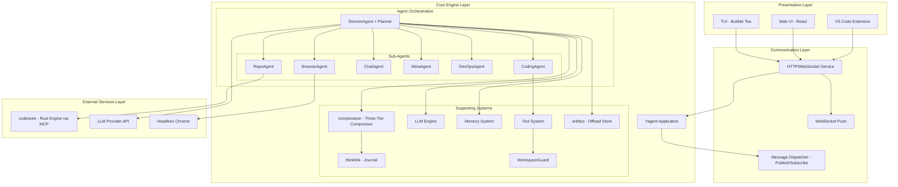
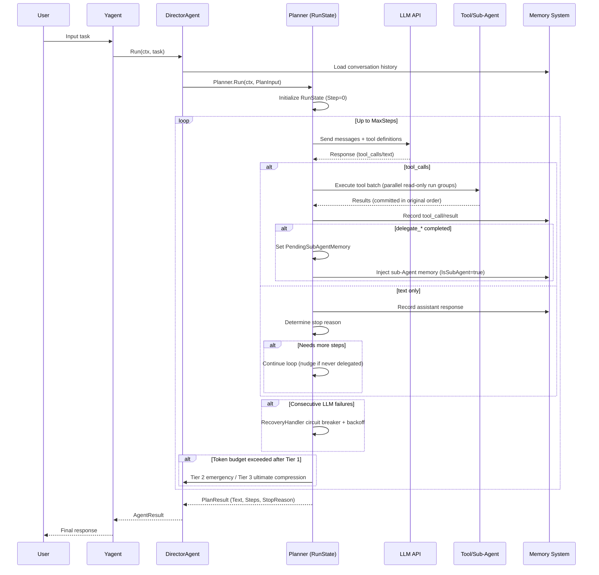
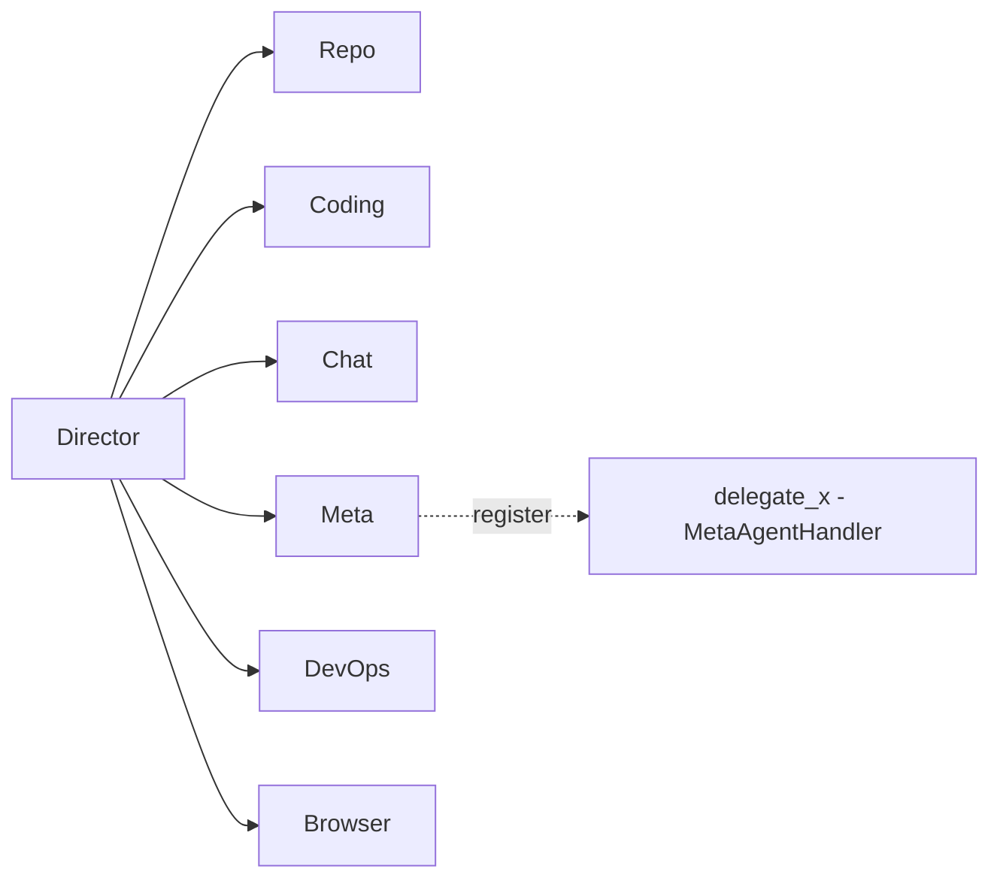
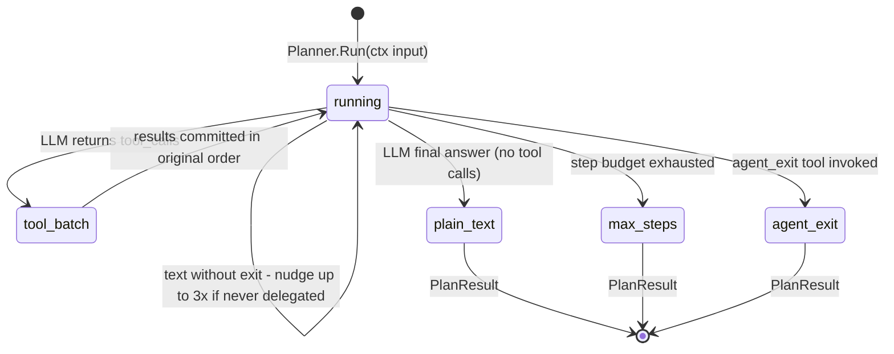
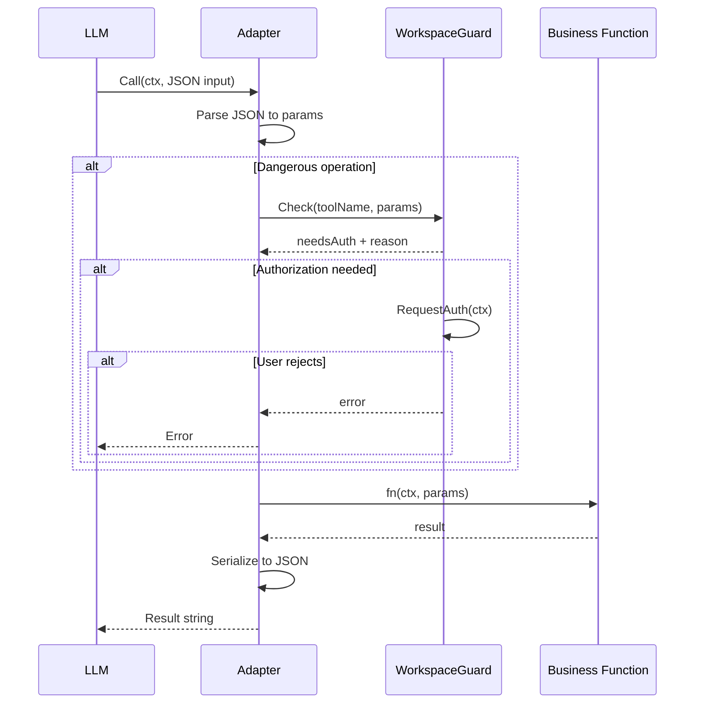
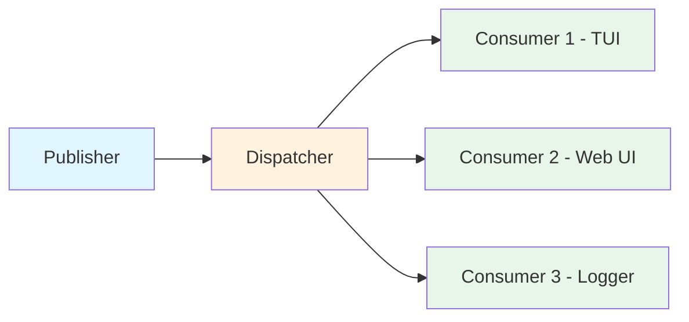
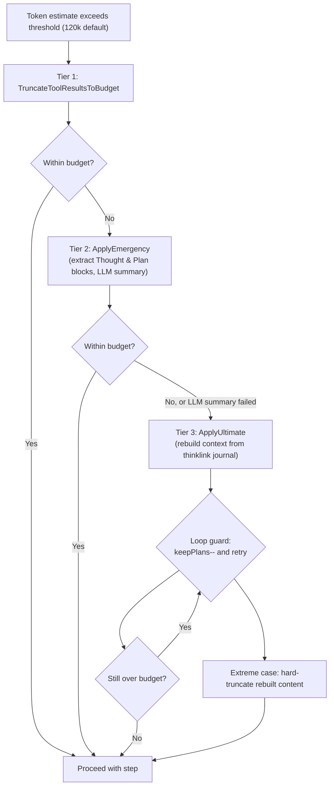
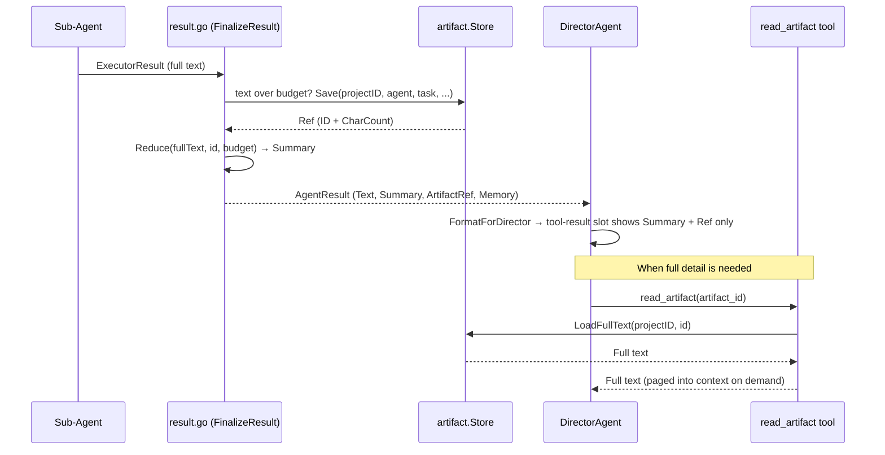
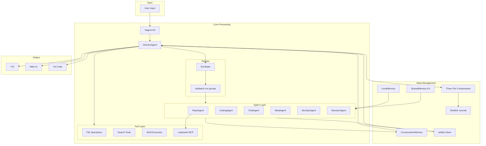
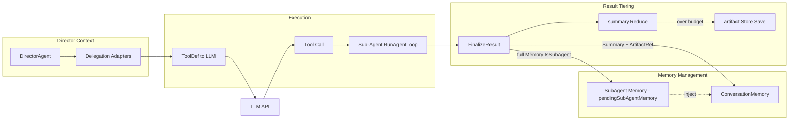

# Yagent 系统架构文档

> 版本：v2.0.0 | 最后更新：2025

## 目录

- [1. 概述](#1-概述)
- [2. 整体架构分层](#2-整体架构分层)
- [3. Agent 系统](#3-agent-系统)
  - [3.1 Agent 接口与端口](#31-agent-接口与端口)
  - [3.2 DirectorAgent 编排器](#32-directoragent-编排器)
  - [3.3 子 Agent 详解](#33-子-agent-详解)
  - [3.4 委派模型](#34-委派模型)
  - [3.5 Planner 状态机](#35-planner-状态机)
  - [3.6 只读工具并行执行](#36-只读工具并行执行)
- [4. 工具系统](#4-工具系统)
  - [4.1 Adapter 模式](#41-adapter-模式)
  - [4.2 工具注册表](#42-工具注册表)
  - [4.3 WorkspaceGuard](#43-workspaceguard)
  - [4.4 委派工具](#44-委派工具)
  - [4.5 核心工具列表](#45-核心工具列表)
- [5. LLM 引擎](#5-llm-引擎)
  - [5.1 Engine 接口](#51-engine-接口)
  - [5.2 消息与工具定义格式](#52-消息与工具定义格式)
  - [5.3 多模型支持与回退](#53-多模型支持与回退)
- [6. 内存系统](#6-内存系统)
  - [6.1 ConversationMemory](#61-conversationmemory)
  - [6.2 LocalMemory](#62-localmemory)
  - [6.3 SharedMemory](#63-sharedmemory)
  - [6.4 Rollout 录制](#64-rollout-录制)
  - [6.5 知识管理](#65-知识管理)
- [7. 事件/消息系统](#7-事件消息系统)
  - [7.1 发布-订阅架构](#71-发布-订阅架构)
  - [7.2 事件类型](#72-事件类型)
  - [7.3 子包结构](#73-子包结构)
- [8. 上下文压缩引擎](#8-上下文压缩引擎)
  - [8.1 包布局](#81-包布局)
  - [8.2 三级之一：工具结果截断](#82-三级之一工具结果截断)
  - [8.3 三级之二：紧急压缩](#83-三级之二紧急压缩)
  - [8.4 三级之三：终极压缩](#84-三级之三终极压缩)
  - [8.5 关键参数与热重载](#85-关键参数与热重载)
- [9. Thinklink 日志](#9-thinklink-日志)
- [10. Artifact 存储](#10-artifact-存储)
- [11. 外部服务集成](#11-外部服务集成)
  - [11.1 Codeseek 代码分析引擎](#111-codeseek-代码分析引擎)
  - [11.2 浏览器自动化](#112-浏览器自动化)
- [12. 表示层](#12-表示层)
  - [12.1 TUI（终端 UI）](#121-tui终端-ui)
  - [12.2 HTTP/WebSocket 服务](#122-httpwebsocket-服务)
  - [12.3 Web UI](#123-web-ui)
  - [12.4 VS Code 扩展](#124-vs-code-扩展)
- [13. 应用启动](#13-应用启动)
- [14. 配置系统](#14-配置系统)
- [15. 关键设计模式](#15-关键设计模式)
- [16. 数据流图](#16-数据流图)
  - [16.1 任务处理完整数据流](#161-任务处理完整数据流)
  - [16.2 子 Agent 结果分层数据流](#162-子-agent-结果分层数据流)
- [17. 术语表](#17-术语表)
- [附录 A. 关键文件索引](#附录-a-关键文件索引)
- [附录 B. 配置示例](#附录-b-配置示例)

---

## 1. 概述

Yagent 是一个 **AI 驱动的自主编码系统**，使用 Go 构建。它采用多 Agent 协作架构，由 LLM（大语言模型）驱动，能够自主完成代码分析、编写、调试与运维等复杂任务。

### 核心特性

- **多 Agent 协作**：6 个专职子 Agent + 1 个编排器，各司其职
- **基于 Planner 的编排**：Director 的主循环是 `director/` 子包中的 `Planner` 状态机（`RunState`）——具体、经过测试的实现，不再是设计规划
- **丰富的工具集**：`tools.json` 中 26 个工具定义（634 行，含 `delegate_browser`），外加 Director 内联构建的 5 个委派工具，以及 `internal/tools/browser/` 中的 10 个浏览器工具（`browser_*` 前缀）
- **只读工具并行**：同一步骤内连续的只读工具调用被归并为运行组（Run Group）并发执行（`toolbatch` 包），由每工具的只读元数据驱动
- **三级上下文压缩**：工具结果截断 → 紧急压缩（对 Thought & Plan 块做 LLM 摘要）→ 终极压缩（基于 thinklink 日志重建上下文），实现于独立的 `internal/compression/` 包
- **Thinklink 日志**：实时滚动记录用户输入与 Director Thought & Plan 块的日志，可在上下文重置后幸存，并支撑终极压缩重建（`internal/thinklink/`）
- **Artifact 卸载**：过大的子 Agent 输出被分层为摘要文本 + 磁盘 artifact 引用（`internal/artifact/`），可经 `read_artifact` 工具按需分页取回
- **内存管理**：对话内存 + 本地便签 + 共享 KV 内存，自动 tool_call 配对修复，rollout JSONL 会话录制
- **安全守卫**：工作区权限检查 + 分级用户确认机制
- **知识管理**：对话前知识检索（经 MCP）、异步记忆整理、仓库记忆缓存
- **多种表示层**：TUI、Web UI、VS Code 扩展、统一协议

### 项目结构

```
yagent/
├── internal/
│   ├── agents/            # Agent 系统核心
│   │   ├── activity/      # 委派活动感知的空闲/总时长超时监视器
│   │   ├── director/      # Planner 主循环、RunState、恢复、指标、
│   │   │                  # Meta-Agent 处理器、项目上下文加载器
│   │   ├── toolbatch/     # 只读工具运行组规划 + 并行执行
│   │   ├── director.go         # DirectorAgent 编排器（委派适配器、压缩接线）
│   │   ├── director_adapter.go # DirectorAdapter（指标 + 恢复集成门面）
│   │   ├── executor.go         # RunAgentLoop 工具执行引擎（ExecutorConfig）
│   │   ├── repo.go / coding.go / chat.go / meta.go / devops.go / browser_agent.go
│   │   ├── consolidation_worker.go # 异步记忆整理（单 goroutine + channel）
│   │   ├── repo_memory.go      # 仓库记忆缓存（SharedMemory 支撑）
│   │   ├── result.go           # AgentResult 收尾（摘要 + artifact 接线）
│   │   ├── read_artifact_tool.go # read_artifact 工具（分页取回被卸载的结果）
│   │   ├── ports.go            # 窄的按消费者接口（端口与适配器）
│   │   ├── knowledge_hook.go   # 知识提取钩子
│   │   ├── git_checkpoint.go   # Git checkpoint 机制
│   │   └── tools.json          # 工具定义清单（26 个工具）
│   ├── compression/       # 三级上下文压缩（Phase 3-0 新增）
│   ├── artifact/          # 子 Agent 输出卸载存储（新增）
│   ├── thinklink/         # 终极压缩日志（新增）
│   ├── tools/             # 工具系统（adapter、registry、workspace_guard、delegate 辅助）
│   │   └── browser/       # 10 个浏览器工具（browser_* 前缀）
│   ├── browser/           # 浏览器自动化（BrowserManager、配置、安全）
│   ├── llm/               # LLM 引擎抽象（engine_openai、engine_anthropic、fallback、netretry）
│   ├── memory/            # 内存系统（ConversationMemory、LocalMemory、SharedMemory、Rollout）
│   ├── messaging/         # 消息系统（publisher、dispatcher）
│   │   └── consumers/     # TUIConsumer、WebSocketConsumer
│   ├── protocol/          # 协议定义（agent_events.go）
│   ├── config/            # 配置系统（defaults、hot_reload）
│   ├── datamanager/       # 任务数据持久化（DataManager、JSONL 读写/索引）
│   ├── knowledge/         # 知识注入器（KnowledgeInjector、对话前检索）
│   ├── mcp/               # MCP 客户端（MCPClient、stdio JSON-RPC）
│   ├── recovery/          # 熔断器（CircuitBreaker、closed/open/half-open）
│   ├── registry/          # 能力注册表（CapabilityRegistry）
│   ├── skills/            # 技能系统（SkillRegistry，加载 .md 技能文件）
│   ├── dict/              # 词典/自动补全引擎（DictEngine）
│   ├── diff/              # Diff 对比工具
│   ├── embedbin/          # 内嵌二进制（codeseek 引擎）
│   ├── globalctx/         # 全局上下文单例（GlobalCtx、EnvView、RepoContextStore）
│   ├── logging/           # 任务级日志目录管理
│   ├── tokenutil/         # Token 计数工具
│   ├── util/              # 通用工具（crash、error_utils、numeric）
│   ├── app/               # 应用启动（Yagent.Init）
│   ├── tui/               # 终端 UI（common/、components/、layout/、anim/）
│   └── http/              # HTTP/WebSocket 服务
├── codeseek/              # Rust 代码分析引擎（源码）
├── vscode/                # VS Code 扩展
├── webui/                 # Web 前端
├── protocol/              # 协议 Schema
└── config/                # 配置文件
```

> **注意（v2.0.0）**：上下文压缩不再是 `agents` 包的一部分。原 `context_compressor.go` / `emergency_compressor.go` 文件已被抽取为独立的 `internal/compression/` 包（Phase 3-0），连同新增的 `internal/thinklink/` 与 `internal/artifact/` 包。

---

## 2. 整体架构分层

Yagent 采用经典的四层架构设计，自上而下：



### 分层说明

| 层级 | 职责 | 关键组件 |
|-------|----------------|----------------|
| **表示层** | 用户交互界面 | TUI、Web UI、VS Code 扩展 |
| **通信层** | 进程间通信、事件分发 | HTTP Server、WebSocket、消息调度器 |
| **核心引擎层** | 业务逻辑、AI 推理 | DirectorAgent/Planner、子 Agent、工具、LLM、内存、压缩、Thinklink、Artifact |
| **外部服务层** | 外部能力集成 | codeseek（MCP）、LLM API、Headless Chrome |

---

## 3. Agent 系统

### 3.1 Agent 接口与端口

系统中所有 Agent 都实现统一的 `Agent` 接口：

```go
// internal/agents/types.go
type Agent interface {
    Name() string
    Run(ctx context.Context, input string) (AgentResult, error)
}

type AgentResult struct {
    Text        string               // 完整文本输出（供程序化消费：输出解析、
                                     // 整理、错误信息）。不会注入 Director 的
                                     // LLM 上下文。
    Summary     string               // 分层摘要（<500 token，供 Director 上下文；
                                     // 未截断/未卸载时等于全文）
    ArtifactRef *artifact.Ref        // 完整结果的磁盘引用（经 read_artifact
                                     // 分页取回）；nil = 未截断/未卸载
    Memory      []memory.ChatMessage // 子 Agent 的完整内部对话历史
                                     // （IsSubAgent=true；GroupID/ParentID 由 Director 填写）
}

type BaseAgent struct {
    LLM       llm.Engine
    Publisher EventBus
}
```

**结果收尾**（`internal/agents/result.go`）：

- `FinalizeResult(agentName, task, exec ExecutorResult)`：基于 `ExecutorResult` 构建 `AgentResult`，生成分层的 `Summary`，并在文本超出预算时经 artifact 存储的 `summary.Reduce` 生成 `ArtifactRef`（见 10）。`FinalizeResultFull` 是为需要更丰富记录的调用方提供的变体。
- `FormatForDirector(toolName, r AgentResult)`：将结果格式化后注入 Director 的工具结果槽——摘要文本外加 artifact 指针，绝不包含被卸载的全文。
- `SetProjectPathProvider(fn)`：用于 artifact 项目 ID 计算的接线钩子。

**设计要点**：

- `Name()` 返回 Agent 的唯一标识（snake_case 格式）
- `Run()` 接收任务描述字符串，返回分层结果与完整的内部对话历史
- `AgentResult.Memory` 包含 `IsSubAgent=true` 的完整对话记录，由 Director 注入主上下文

#### 3.1.1 窄接口

`internal/agents/ports.go` 定义了按消费者划分的窄接口（端口与适配器模式）。每个 Agent 构造函数只声明它实际需要的接口；每个端口都由具体类型自然实现（无需任何适配器代码）：

| 端口 | 实现者 | 用途 |
|------|-------------|---------|
| `EventBus` | `*messaging.MessagePublisher` | 事件发布（Publish + PublishWithMetadata） |
| `PromptFormatter` | `*globalctx.GlobalCtx` | 向系统提示词追加环境/语言/自定义指令 |
| `Env` | `*globalctx.EnvView` | 动态运行时环境视图（ProjectPath、FullYoloMode） |
| `RepoContextStore` | `*globalctx.RepoContextStore` | 仓库摘要缓存——由 delegate_repo 写入，由 coding/browser 提示词构建方读取 |
| `KnowledgeProvider` | `*knowledge.KnowledgeInjector` | 对话前知识检索/注入 |
| `FileToolSet` | `*tools.FileOperationsTool` | read_file、list_dir、print_dir_tree、create_file、delete_file、rename_file |
| `SearchToolSet` | `*tools.SearchOperationsTool` | grep 搜索 |
| `SysToolSet` | `*tools.SystemOperationsTool` | run_bash |
| `EditToolSet` | `*tools.ReplaceBlockTool` | 块替换编辑 |
| `RepoToolSet` | `*tools.RepoOperationsTool` | semantic_search、代码骨架/片段、调用图 |
| `FlowToolSet` | `*tools.FlowControlTool` | `agent_exit`、`ask_user_for_help` |
| `Thinker` | `*tools.ThinkingTool` | 轻量推理工具 |
| `DeepThinker` | `*tools.DeepThinkingTool` | 深度分析工具 |
| `MicroAgentRunner` | `*tools.MicroAgentTool` | 隔离上下文的 micro-agent 子任务运行器 |

> 这些端口将 Agent 与 `globalctx.GlobalCtx` 巨型上下文解耦。注意 `FlowToolSet` 只提供流程控制工具（`agent_exit` / `ask_user_for_help`）；`delegate_*` 工具由 DirectorAgent 自行单独构建（见 4.4）。

### 3.2 DirectorAgent 编排器

**DirectorAgent** 是整个系统的"大脑"，位于 `internal/agents/director.go`，负责：

1. **任务评估**：分析用户意图，选择合适的子 Agent
2. **委派调度**：通过工具调用将任务分发给子 Agent
3. **结果聚合**：收集子 Agent 输出，整合为最终响应
4. **流程控制**：状态管理、重试、熔断、上下文压缩协调

Director 的主循环不再内联在 `Run()` 中：循环体位于 **`Planner`**（`internal/agents/director/planner.go` + `planner_run.go`），按步骤的工具执行由 `RunAgentLoop`（`executor.go`）经 `directorToolRunner` 适配器提供，`Run()` 现在是薄门面（`run()` → `Planner.Run()`）。

#### 3.2.1 Director 结构（分组）

```go
type DirectorAgent struct {
    BaseAgent

    // ── 子 Agent 引用 ──
    RepoAgent    *RepoAgent
    CodingAgent  *CodingAgent
    ChatAgent    *ChatAgent
    MetaAgent    *MetaAgent
    DevOpsAgent  *DevOpsAgent
    BrowserAgent *BrowserAgent

    // ── 窄接口 / 工具集（ports.go，构造时注入）──
    promptFmt   PromptFormatter
    env         Env
    files       FileToolSet
    search      SearchToolSet
    sys         SysToolSet
    edit        EditToolSet
    flow        FlowToolSet
    thinker     Thinker
    microAgent  MicroAgentRunner
    deepThinker DeepThinker

    // ── 安全与上下文 ──
    guard     *tools.WorkspaceGuard
    repoCtx   RepoContextStore
    knowledge KnowledgeProvider
    mcpClient *mcp.MCPClient

    // ── 工具注册 ──
    Adapters   []*tools.Adapter                // 暴露给 LLM 的 delegate_* + 认知工具
    toolDefMap map[string]tools.ToolDefinition // 工具名 → tools.json 中的定义

    // ── 动态 Agent 注册与集成切面 ──
    metaHandler      *director.MetaAgentHandler     // Meta 设计的自定义 Agent（Phase 2d）
    adapter          *DirectorAdapter               // 指标 + 恢复集成门面
    llmClient        *llm.Client                    // 运行时引擎重解析
    projectCtxLoader *director.ProjectContextLoader // 项目上下文加载（Phase 2a，带缓存）

    // ── 内存与压缩 ──
    currentMemory          *memory.ConversationMemory   // Run 期间的活动内存
    pendingSubAgentMemory  *AgentResult                 // 待注入的最新委派结果
    pendingSubAgentMu      sync.Mutex                   // 保护 pendingSubAgentMemory（并发委派）
    injectSubAgentMemoryMu sync.Mutex                   // 保护并行委派对 currentMemory 的追加
    compressor             *compression.ContextCompressor // 上下文压缩编排器（Phase 3-0）

    // ── 超时与并发 ──
    llmTimeout               time.Duration // 单次 LLM 调用超时（config [llm].timeout；默认 5 分钟）
    delegateIdleTimeout      time.Duration // 委派活动感知空闲超时
    delegateTotalTimeout     time.Duration // 委派总时长上限（0 = 不限）
    maxParallelReadOnlyTools int           // 只读工具运行组的最大并行度

    // ── 其他 ──
    EnhancedCommanderCfg config.EnhancedCommanderConfig
    thinkLink            *thinklink.Store       // 终极压缩日志（与 Director 同生命周期）
    taskID               string
    // 以及：maxSteps、metaRetryCount、customAgents（动态注册）
}
```

> **注意**：`director.go` 内一条过时注释称 LLM 超时"默认 3 分钟"；实际生效的代码路径（`defaults.go`：`[llm].timeout = 5 * time.Minute`，以及 `cfg.LLM.Timeout > 0 → 否则 5 分钟` 的回退）使 **5 分钟**成为真实默认值。本文档以实际生效的代码为准。

#### 3.2.2 委派工具链

Director 通过 Adapters 向 LLM 暴露工具，其中核心是 6 个委派工具外加 artifact 取回工具：

| 工具名 | 目标 Agent | 用途 |
|-----------|-------------|---------|
| `delegate_repo` | RepoAgent | 代码分析、语义搜索（标记为只读——在并行运行组内安全） |
| `delegate_coding` | CodingAgent | 文件读写、代码编辑 |
| `delegate_chat` | ChatAgent | 通用对话、讲解 |
| `delegate_meta` | MetaAgent | 自定义 Agent 生成（被禁止进入并行组） |
| `delegate_devops` | DevOpsAgent | 系统操作、Shell 命令 |
| `delegate_browser` | BrowserAgent | 浏览器自动化 |
| `read_artifact` | — | 按 artifact ID 分页取回先前被卸载的 AgentResult |

#### 3.2.3 Director Run 流程



#### 3.2.4 容错机制

LLM 故障处理状态已从 DirectorAgent 上提至 `director.RecoveryHandler`（`internal/agents/director/recovery.go`），经由 `DirectorAdapter` 门面访问：

```go
// internal/agents/director/recovery.go
type RecoveryConfig struct {
    MaxRetries                 int           // 步骤重试次数
    LLMRetries                 int           // LLM 步骤级重试（来自配置 [llm].step_retries）
    CircuitBreakerThreshold    int           // 0 = 禁用
    CircuitBreakerResetTimeout time.Duration // 熔断器重置窗口
}

type RecoveryHandler struct {
    config       RecoveryConfig
    breaker      *recovery.CircuitBreaker // closed/open/half-open（internal/recovery）
    stepFailures map[string]int           // stepID → 失败次数
    consecutiveLLMFailures int            // 成功时不重置（保留旧语义）
    lastLLMFailureTime     time.Time
}
```

- **熔断器**：当连续 LLM 调用失败达到 `CircuitBreakerThreshold` 时，`IsCircuitBreakerOpen()` 为主循环设置闸门；恢复遵循半开（half-open）模式（`internal/recovery/circuit_breaker.go`）
- **步骤重试**：无效的 LLM 响应经 `RetryWithBackoff` / `ComputeBackoff`（指数退避）重试当前步骤；重试次数来自 `config.LLM.StepRetries`
- **瞬时故障检测**：`IsLLMFailureTransient(err)` 对可重试的网络/限流错误进行分类
- **tool_call 配对修复**：`validateAndRepairToolCallPairs`（Director 侧）与 `repairToolCallPairsAfterTruncation`（内存侧）在截断或压缩后自动修复失配的 tool_call / tool_response 配对

#### 3.2.5 DirectorAdapter（集成门面）

`internal/agents/director_adapter.go` 是将 Director 与抽取出的 `director/` 子包组件（Phase 2/3 重构）粘合的门面：

```go
type DirectorAdapter struct {
    metrics  *director.MetricsCollector  // LLM 耗时、工具调用计数、错误统计
    recovery *director.RecoveryHandler   // 重试 + 熔断状态
}
```

方法：`RecordLLMDuration`、`RecordLLMSuccess` / `RecordLLMFailure` / `RecordLLMFailureStats`、`IsCircuitBreakerOpen`、`LLMRetries`、`ConsecutiveLLMFailures`。DirectorAgent 以 `adapter *DirectorAdapter` 持有它，并同时持有 `llmClient *llm.Client`，用于运行时按 Agent/按工具的引擎重解析。`director/` 子包中的配套组件：

- `metrics.go` — `MetricsCollector`：任务/工具调用计数、按来源错误统计、LLM 耗时、`Snapshot()`
- `recovery.go` — `RecoveryHandler`（如上）
- `project_context.go` — `ProjectContextLoader`：每会话加载一次项目上下文文件（内部缓存），外加 `ComputeProjectID`

### 3.3 子 Agent 详解

| Agent | 文件 | 核心工具集 | 说明 |
|-------|------|---------------|-------|
| **RepoAgent** | `repo.go` | semantic_search、query_code_skeleton、query_code_snippet、find_function_callee/caller、query_call_graph、read_file、search_by_regex | 经 MCP 调用 codeseek；将系统提示词放入 Human 角色消息（`SystemAsHuman`）以受益于提示词缓存；写入 `repoCtx` 摘要 |
| **CodingAgent** | `coding.go` | create_file、search_replace_in_file、delete_file、rename_file、run_bash、thinking、micro_agent、deepthinking | 在系统提示词中接收 `repoCtx`；持有 Git checkpoint 配置 |
| **ChatAgent** | `chat.go` | thinking、micro_agent、deepthinking | 无文件操作权限；纯对话 Agent |
| **MetaAgent** | `meta.go` | thinking | 单次 LLM 调用生成 JSON Agent 设计；经 MetaAgentHandler 注册并立即执行 |
| **DevOpsAgent** | `devops.go` | run_bash、read_file、search_by_regex、文件操作 | 系统管理、日志分析、临时 Shell |
| **BrowserAgent** | `browser_agent.go` | browser_* 工具（10 个） | 驱动 BrowserManager（go-rod、Headless Chrome） |

#### MetaAgent 输出格式

```json
{
  "thinking": "...",
  "agent_name": "my_custom_agent",
  "agent_design": "System prompt...",
  "tools_used": ["read_file", "search_by_regex"],
  "task_for_agent": "Task description template..."
}
```

JSON 设计由 `director.MetaAgentHandler.ParseMetaAgentOutput` / `ExtractJSONObject` 解析（解析失败时最多重试 `metaRetryCount` 次），注册为永久的 `delegate_<name>` 工具，并立即执行以完成当前任务。

### 3.4 委派模型

> **注意（v2.0.0）**：早期版本描述了静态 `DelegationGraph` DAG（带 DFS 环检测与 Kahn 拓扑排序）。该设计已不在代码库中存在。委派如今**完全由 Director 暴露的 delegate 工具集合**定义，并由 Planner 状态机的 **RunState 计数器**守护（3.5）。不再保留任何 `DelegationGraph` 类型、DFS 校验或拓扑排序。



**委派来源**：

1. **内建 delegate 工具**——除定义于 `tools.json` 清单的 `delegate_browser` 外，其余 5 个在 `NewDirectorAgent()` 中以 `tools.NewAdapter("delegate_repo", ...)` 等方式内联创建（见 4.4）。每个闭包经 `executeCustomAgent` / `applyEnhancedCommander` 运行目标子 Agent，并通过 `takePendingSubAgentMemory` 将结果路由至内存注入。
2. **动态 delegate 工具**——由 MetaAgent 设计，经 `director.MetaAgentHandler.Register()` / `DirectorAgent.registerCustomAgent()` 注册；它们在进程的剩余生命周期内成为永久的 `delegate_<name>` 工具。

**委派生命周期与超时**（`internal/agents/activity/`）：每次委派调用都在一个活动感知的空闲超时监视器下运行：

- `WithIdleTimeout(ctx, Options)` 创建受监视的上下文；工具启动、LLM 完成、显式 `Heartbeat(ctx, detail)` 调用都会刷新最近活动时间戳（轮询间隔默认 1 秒）
- 空闲上限：显式设置 `config.Agent.DelegateIdleTimeout` 时生效，否则推导为 `max(10 min, llmTimeout + 5 min)`；总时长上限经 `DelegateTotalTimeout` 设置（0 = 不限）
- 取消以 `IdleTimeoutError` / `TotalTimeoutError` 呈现，二者都携带实际的空闲/已用时长、最近活动类别（如 `tool:start:run_bash`）及其停滞时长，便于诊断

**防空转守卫**：如果 LLM 从未委派就结束了步骤，Planner 会注入强制的"立即委派"提醒，至多 `maxNonDelegationPrompts = 3` 次（`RunState.NonDelegationPrompts`）；`DelegationAttempts` 跟踪每一次委派尝试（无论成败）。

### 3.5 Planner 状态机

Director 的主循环状态现在是一个具体实现（此前文档将其标注为"设计规划"）：

```go
// internal/agents/director/planner.go
type RunState struct {
    Step                  int   // 当前主循环步骤
    MaxSteps              int   // 步骤预算（原 a.maxSteps）
    HasDelegated          bool  // 本次任务期间是否有 delegate 工具运行过
    NonDelegationPrompts  int   // 迄今注入的强制提醒次数（上限 3）
    DelegationAttempts    int   // 委派尝试次数（无论成败）
    PendingSubAgentMemory *memory.SubAgentMemory
    mu sync.Mutex // 在并发 ToolRunner.Call 路径上保护计数器
}

func (s *RunState) RecordDelegation(ok bool)
func (s *RunState) SetPendingSubAgentMemory(m *memory.SubAgentMemory)
```

主循环是 `director/planner_run.go` 中的 `Planner.Run(ctx, PlanInput) (PlanResult, error)`，经 `PlannerConfig` 接线：

- **注入的客户端**：`LLM LLMClient`、`Publisher EventPublisher`、`Journal ThinklinkStore`、`Rollout *memory.RolloutWriter`、`Tools ToolRunner`、`Prompts PromptBuilder`（均容忍 nil）
- **压缩**：`Compressor *compression.ContextCompressor`，外加 `CompressEnable`、`CompressThreshold`、`CompressKeepTokens`、`UltimateCompressEnable`、`UltimateCompressKeepPlans`
- **恢复 / 指标**：`Recovery *RecoveryHandler`、`Metrics *MetricsCollector`（同包类型）
- **闭包注入**：`NormalizeMessages`（tool_call 配对修复）、`EstimateTokensFn`、`ConvertToolCallsFn`——`director` 子包不允许导入 `agents` 包，因此旧有辅助函数以函数字段注入
- **调度**：`MaxParallelReadOnlyTools`（在上游经 `agents.NormalizeMaxParallelReadOnlyTools` 归一化）与 `IsParallelizableTool` 谓词；`ToolTimeout`（默认 120 秒——`delegate_*` 由门面应用专用的 10 分钟超时）
- `LLMTimeout`：单次 LLM 调用超时（原 `a.llmTimeout`，默认 5 分钟）

**停止原因**（`PlanResult.StopReason`）：`agent_exit`（显式退出工具）、`plain_text`（LLM 以文本答案结束）、`max_steps`（步骤预算耗尽）。



### 3.6 只读工具并行执行

在单个 Planner/Executor 步骤内，**只读且无副作用**的连续工具调用会被归并为一个"运行组"并发执行——这是自本架构文档上一版以来引入的调度机制。

**规划**（`internal/agents/toolbatch/plan.go`）：

```go
type Segment struct {
    Parallel bool   // 该段是否可并发执行
    Indices  []int  // 该运行组内元素的下标
}

// 将 [0, total) 切分为最大运行组：一段连续的可并行下标构成一个
// Parallel 段；不可并行的元素保持为单元素串行段。
func Plan(total int, isParallelizable func(i int) bool) []Segment
```

**执行**（`internal/agents/toolbatch/run.go`）：

```go
// 运行一个段。并行段在至多 `parallel` 个 goroutine 间扇出（每个都经
// guardedExec 包裹 panic 恢复）；串行段一次执行一个。结果就绪后，
// onCommit 对每个元素恰好触发一次，且严格按原始下标顺序——无论完成
// 顺序如何，内存追加、事件与 rollout 记账都保持确定性。
func Run[T any](ctx context.Context, seg Segment, parallel int,
    exec func(ctx context.Context, i int) T,
    onCommit func(i int, res T))
```

**可并行性谓词**：工具只有在满足以下条件时才参与并行运行组：其 `Adapter.IsReadOnly()` 为 true（见 4.1）、非交互式、且未被列入禁止清单。禁止清单目前包含 `agent_exit`（停止语义）与 `delegate_meta`（注册表副作用）——它们始终原位串行执行。内建委派工具中只有 `delegate_repo` 被标记为只读（`WithReadOnly(true)`）；`delegate_coding/devops/browser/meta` 则不然，因为 coding 写文件、devops 运行进程、browser/meta 具有会话级副作用。并行度由 `MaxParallelReadOnlyTools` 封顶：0/负数 → 默认 4，1 → 严格串行的急停开关（与旧版逐位一致），上限钳制到 8。

**并发安全说明**（源自源码注释）：并行 delegate 闭包会在 `pendingSubAgentMemory` 与 `currentMemory` 追加上竞争；两者均有锁保护（`pendingSubAgentMu`、`injectSubAgentMemoryMu`），"最新写入胜出" / 按完成顺序记账的语义与串行时代一致。

---

## 4. 工具系统

工具系统位于 `internal/tools/`，提供统一、安全的工具调用接口。

### 4.1 Adapter 模式

**Adapter** 是工具系统的核心抽象，将函数包装为 LLM 可消费的工具定义：

```go
// internal/tools/adapter.go
type ToolFunc func(ctx context.Context, params map[string]interface{}) (interface{}, error)

type Adapter struct {
    name        string
    description string
    fn          ToolFunc
    schema      map[string]interface{}
    guard       *WorkspaceGuard
    readOnly    bool // 只读 / 无副作用元数据：该工具不修改任何共享状态
                     // （文件、进程）；可安全进入并行运行组
}
```

**关键方法**：

- `NewAdapter(name, description, fn)`：创建适配器
- `WithSchema(schema)`：设置 JSON Schema（链式选项）
- `WithReadOnly(enabled)`：显式设置只读元数据（零值为 false；将有副作用的工具标记为只读是一个 bug）
- `WithReadOnlyIfKnown()`：按工具名白名单自动标记——在 `tools.json` 批量注册点调用
- `IsReadOnly()`：查询元数据（toolbatch 调度器使用）
- `Call(ctx, input)`：执行工具调用，自动触发守卫检查
- `ToToolDef()`：转换为 LLM 的 `ToolDef` 格式

**工作流**：



### 4.2 工具注册表

**Registry** 是线程安全的工具注册表，支持注册/查找/列举：

```go
// internal/tools/registry.go
type Registry struct {
    adapters map[string]*Adapter
    mu       sync.RWMutex
    hash     string // 工具列表哈希（缓存一致性检测）
    dirty    bool   // 哈希需要重算
}
```

**API**：`Register(*Adapter)`、`Execute(ctx, name, params)`、`List()` —— 另有廉价的变更检测：注册工具会置 `dirty`，而记忆化的工具列表 `hash` 让系统提示词层无需逐名比对即可察觉"工具集已变化"。

**特性**：

- 线程安全（读写锁）
- 按名称索引
- 批量获取（供 LLM 系统提示词使用）
- 记忆化的工具列表哈希用于缓存一致性检查

### 4.3 WorkspaceGuard

**WorkspaceGuard**（工作区安全守卫）在执行前检查危险操作，确保操作留在工作区内：

```go
// internal/tools/workspace_guard.go
type WorkspaceGuard struct {
    workspacePath     string
    confirmMgr        *UserConfirmManager
    sessionAllowed    map[string]bool // 已获全会话授权的工具
    sessionAllAllowed bool            // 本会话内所有工具均已授权
    projectAuthorized bool            // 项目永久授权（来自 settings.json）
    yoloMode          bool            // 跳过所有授权检查
}
```

**危险工具列表**（v2.0.0 中保持不变）：

| 工具名 | 检查类型 |
|-----------|------------|
| `create_file` | 路径在工作区内 |
| `search_replace_in_file` | 路径在工作区内 |
| `delete_file` | 路径在工作区内 |
| `rename_file` | 路径在工作区内 |
| `run_bash` | 命令检查 |

**授权级别**（每次危险调用都自上而下求值）：

| 优先级 | 级别 | 效果 |
|----------|-------|--------|
| 1 | **YOLO 模式** | 跳过所有授权检查 |
| 2 | **项目永久授权**（`allow_all_project`） | 持久化到 settings.json；全部跳过 |
| 3 | **会话全量授权**（`allow_all_session`） | 本会话内所有工具均获授权 |
| 4 | **会话单工具授权**（`allow_session`） | 本会话内该工具获授权 |
| 5 | **首次调用** | `RequestAuth(ctx)` 阻塞直至用户批准或拒绝 |

### 4.4 委派工具

> **注意（v2.0.0）**：`internal/tools/delegate.go` 仍然存在——它定义了 `AgentRunner` 接口（`Run(ctx, task) (string, error)`）、一个 `NewDelegateAdapter` 构建器与一个 `DelegateFunc` 适配器——但当前**没有任何调用点**。它作为通用辅助函数保留。

六个内建 `delegate_<agent>` 工具均在 `NewDirectorAgent()` 中装配：其中 5 个以普通 `tools.NewAdapter` 实例的形式**内联构建**，闭包负责运行目标子 Agent（经 `executeCustomAgent` / `applyEnhancedCommander`，各自拥有独立的工具注册表、步骤预算、LLM 引擎与委派超时）；`delegate_browser` 则是 `tools.json` 清单中定义的唯一委派工具（见 4.5）。内联构建使 `delegate_repo.WithReadOnly(true)` 这类按工具定制成为可能：

```go
// internal/agents/director.go (abridged)
delegateRepo := tools.NewAdapter("delegate_repo", "Delegate analysis task to Repo-Agent",
    func(ctx, params) {...}).WithReadOnly(true)
delegateCoding := tools.NewAdapter("delegate_coding", "Delegate coding task to Coding-Agent",
    func(ctx, params) {...})
// ... delegate_chat, delegate_devops, delegate_browser, delegate_meta
```

由 MetaAgent 设计的自定义 Agent 经 `DirectorAgent.registerCustomAgent(ca *CustomAgent)` 注册，会额外创建一个 `delegate_<name>` 适配器并加入活动的 Adapters 列表与 `toolDefMap`。

### 4.5 核心工具列表

**26 个工具定义**位于 `internal/agents/tools.json`（634 行），包含 `delegate_browser`（清单中定义的唯一委派工具）。另有 5 个委派工具在代码中注册（Director 内联），`read_artifact` 工具在 `read_artifact_tool.go`，以及 10 个浏览器工具在 `internal/tools/browser/`。

| 类别 | 工具 | 说明 |
|----------|------|-------------|
| **文件操作** | `read_file` | 读取文件内容 |
| | `create_file` | 创建新文件 |
| | `search_replace_in_file` | 搜索并替换文本块 |
| | `delete_file` | 删除文件 |
| | `rename_file` | 重命名文件 |
| **目录浏览** | `list_dir` | 查看目录内容 |
| | `print_dir_tree` | 打印目录树 |
| **搜索 / 分析** | `search_by_regex` | 正则表达式搜索 |
| | `semantic_search` | 语义代码搜索（调用 codeseek） |
| | `query_code_skeleton` | 获取代码骨架 |
| | `query_code_snippet` | 获取代码片段 |
| | `find_function_callee` | 查找某函数所调用的函数 |
| | `find_function_caller` | 查找调用某函数的函数 |
| | `query_call_graph` | 查询调用图 |
| **系统** | `run_bash` | 执行 Shell 命令 |
| **认知** | `thinking` | 轻量思考工具 |
| | `micro_agent` | 隔离上下文的 micro-agent 子任务 |
| | `deepthinking` | 深度分析（一级截断豁免） |
| **交互** | `ask_user_for_help` | 请求用户帮助（confirm/select/input） |
| | `agent_exit` | 退出 Agent 循环 |
| **Git** | `git_checkpoint_list` | 列出检查点 |
| | `git_checkpoint_create` | 创建检查点 |
| | `git_checkpoint_rollback` | 回滚到检查点 |
| **知识** | `consolidate_knowledge` | 整理知识 |
| | `prune_history` | 清理历史知识 |
| **Artifact** | `read_artifact`（代码中注册） | 按 ID 分页取回被卸载的子 Agent 输出 |
| **委派**（代码中注册） | `delegate_repo` | 委派代码分析 |
| | `delegate_coding` | 委派编码任务 |
| | `delegate_chat` | 委派对话 |
| | `delegate_meta` | 委派 Agent 设计 |
| | `delegate_devops` | 委派运维任务 |
| | `delegate_browser` | 委派浏览器操作（tools.json 中定义的唯一委派工具） |
| **浏览器**（`internal/tools/browser/`，10 个工具） | `browser_navigate`、`browser_click`、`browser_scroll`、`browser_input`、`browser_cookies`、`browser_evaluate`、`browser_extract`、`browser_history`、`browser_pdf`、`browser_wait_element` | 无头浏览器自动化（全部 `browser_` 前缀；`registry.go` 为注册入口） |

---

## 5. LLM 引擎

### 5.1 Engine 接口

LLM 引擎抽象层，支持多种 LLM 提供商：

```go
// internal/llm/engine.go
type Engine interface {
    GenerateContent(ctx context.Context, messages []Message, tools []ToolDef, opts *CallOptions) (*Response, error)
    Model() string
}
```

**实现**：

| 文件 | 实现 | 说明 |
|------|----------------|-------|
| `engine_openai.go` | `EngineOpenAI` | OpenAI 兼容接口（经兼容端点同样适用于 Claude/Gemini）；通过共享参数传递 `ReasoningEffort` |
| `engine_anthropic.go` | `EngineAnthropic` | Anthropic 原生接口；支持思考块、缓存控制、`ReasoningEffort` 覆盖 |
| `fallback.go` | `FallbackEngine` | 按权重排序的提供商故障转移（见 5.3） |
| `llm.go` | `Client` | 客户端门面：引擎构建、按 Agent/按工具的引擎解析 |
| `netretry.go` | — | 面向重试的瞬时网络错误分类 |
| `messages.go` | — | 消息清理辅助：`NormalizeMessages`、`MergeConsecutiveAssistants`、`repairToolCallPairs`、`dropEmptyMessages`、`ensureValidStart` |

### 5.2 消息与工具定义格式

#### 消息格式

```go
// internal/llm/engine.go
type Message struct {
    Role       Role       // system/user/assistant/tool
    Content    string     // 文本内容
    ToolCalls  []ToolCall // 工具调用（assistant 角色）
    ToolCallID string     // 工具调用 ID（tool 角色的响应）
    ToolName   string     // 工具名
    Reasoning  string     // 思考/推理内容（DeepSeek 及类似模型）

    IsAnchored       bool              // 锚定标志：true = 该消息永不被压缩
    TruncationMarker *TruncationMarker // 记录某个工具结果曾被截断
}

type TruncationMarker struct {
    ToolName       string // 如 "run_bash"、"read_file"
    OriginalLen    int    // 原始内容长度（字节）
    OmittedLen     int    // 被省略的字节数
    TruncationPass int    // 0 = 首次截断，1+ = 再次截断
}

type CallOptions struct {
    MaxTokens       int
    Temperature     float64
    StreamHandler   StreamHandler
    ReasoningEffort string // 按调用覆盖；非空（"high"/"max"）时启用
                           // DeepSeek 思考模式
}
```

#### 工具定义

```go
type ToolDef struct {
    Type     string      // "function"
    Function FunctionDef
}

type FunctionDef struct {
    Name        string         // 工具名
    Description string         // 工具描述
    Parameters  map[string]any // JSON Schema
}
```

`TokenUsage` 额外跟踪特定提供商的缓存 token 记账（`CacheCreationInputTokens`、`CacheReadInputTokens`、`TotalInputTokens`），用于跨 OpenAI（缓存计入 `prompt_tokens`）与 Anthropic（缓存不计入 `input_tokens`）的缓存命中率指标。

### 5.3 多模型支持与回退

Yagent 支持为不同的 Agent 和工具配置不同的 LLM 模型：

```
配置层级：
  1. 按 Agent 引擎（最高优先级）
  2. 按工具引擎
  3. 默认引擎
```

```go
// 引擎解析
directorEngine   = client.GetAgentEngine("director")
codingEngine     = client.GetAgentEngine("coding")
microAgentEngine = client.GetToolEngine("micro_agent")
```

引擎可在运行时重新解析：Director 持有 `llmClient *llm.Client`，当热重载配置改变提供商映射时调用 `refreshSubAgentEngines()`（`config.SetToolProvider`、提供商配置查找）。

**回退链**（`internal/llm/fallback.go`）：主引擎失败时，回退提供商按 `FallbackProvider.Weight` **降序**尝试（对 weight 做 `sort.SliceStable`）。每一次回退尝试都受相同的超时/重试设置约束。

**优点**：

- 简单任务使用低成本模型
- 复杂推理使用高质量模型
- Micro-Agent 可使用独立模型

---

## 6. 内存系统

### 6.1 ConversationMemory

管理完整的对话上下文，支持多角色与子 Agent 分组：

```go
// internal/memory/memory.go
type ChatMessage struct {
    Type       MessageType     // system/human/assistant/tool
    Content    string
    ToolCalls  []ToolCallData
    ToolCallID *string
    Timestamp  time.Time
    Metadata   map[string]interface{}
    IsAnchored bool            // 锚定标志：永不被截断丢弃

    // 子 Agent 分组元数据
    GroupID    string  // 同一次子 Agent 调用共享
    ParentID   string  // 指向 Director 的 tool_call_id
    IsSubAgent bool    // 快速过滤标志
}

type ConversationMemory struct {
    Messages []ChatMessage
    MaxSize  int // 默认 300 条消息
}
```

**核心特性**：

1. **自动截断**：超过 MaxSize 时移除最旧的非 system 消息
2. **tool_call 配对修复**：`repairToolCallPairsAfterTruncation` 在截断后自动修复失配的 tool_calls
3. **子 Agent 隔离**：`ToMessages()` 自动跳过 `IsSubAgent` 消息
4. **子 Agent 注入**：子 Agent 完成后，Director 将其完整内存注入主上下文

### 6.2 LocalMemory

Agent 私有的消息内存，不跨 Agent 共享：

```go
// internal/memory/local.go
type LocalMemory struct {
    agentID  string              // 所属 Agent 的标识
    messages []ChatMessage       // 私有消息历史
    maxSize  int                 // 最大消息数（默认 200）
    mu       sync.RWMutex
    metadata map[string]interface{}
}
```

**API**：`AddMessage`、`GetMessages`、`GetContext`、`Clear`、`Size`、`FilterByType`、`Trim(keepLast)`、`ToLLMMessages`，元数据 `Set/Get`。

**用法**：

- Agent 内部状态跟踪
- 任务上下文缓存
- 避免冗余的 LLM 调用

### 6.3 SharedMemory

跨 Agent 共享内存，带 KV 持久化与订阅（`internal/memory/shared.go`）：

```go
type SharedMemory struct {
    messages    []ChatMessage
    maxSize     int      // 默认 500（应用启动时以 100 构造）
    subscribers []func(ChatMessage)
    // 用于简单键值持久化的 KV 存储
    kv  map[string]string
    // 可选的周期性持久化
    persistPath string
    ...
}
```

**API**：`AddMessage` / `Publish`、`GetMessages`、`GetContext`、`Subscribe(fn) -> 取消订阅`、`FilterByAgent`，KV 操作（`SetKey/GetKey/DeleteKey/HasKey`），以及 `EnablePersistence(interval, filePath)`（启动周期性保存 ticker），另有 `MarkDirty`、`Close`。

**用法**：`RepoMemoryStore`（6.5）将其缓存持久化到 SharedMemory 的 KV 存储中。

### 6.4 Rollout 录制

每个任务都可录制成 Codex 兼容的 Rollout JSONL 文件（`internal/memory/rollout_writer.go`、`rollout_types.go`、`rollout_convert.go`）：

- `RolloutWriter` 将 JSONL 事件流式写入任务日志目录；每个任务创建一个写入器（`DirectorAgent.createRolloutWriter`）
- 经 `PlannerConfig.Rollout` 注入 Planner，并经 `memory.WithRolloutWriter(ctx, w)` / `GetRolloutWriter(ctx)` 注入工具执行
- `rollout_convert.go` 将 LLM 消息/事件映射为 rollout 记录类型；`rollout_types.go` 定义线上格式

### 6.5 知识管理

#### KnowledgeInjector

**职责**：在 Agent 对话执行前，从代码库检索相关知识并注入上下文。

**位置**：`internal/knowledge/injector.go`（约 315 行）

```go
type InjectionContext struct {
    UserMessage string   // 当前用户输入 / 任务描述
    TargetFiles []string // 可选的目标文件路径
    AgentName   string   // 触发 Agent（用于日志关联）
    Domains     []string // 要搜索的知识域（repo / coding）；空 = 全部
}

type KnowledgeInjector struct {
    mcpClient *mcp.MCPClient
    cfg       config.KnowledgeConfig
    publisher EventPublisher // 失败安全的发布事件（注入摘要）
}
```

**工作流**：

1. `BuildQuery(injCtx)` 构建检索查询
2. 经 `mcpClient.KnowledgeSearch()`（codeseek MCP）检索相关代码片段与知识条目
3. 按 `InjectionMinScore`（默认 **0.3**）过滤
4. `FormatKnowledgeBlock` 格式化注入块，受 `InjectionMaxTokens` 约束
5. 发布注入摘要事件（`context_loaded`）

> **状态说明**：`Inject()` 目前会短路返回（`disabled := true`）——知识加载/注入被临时硬禁用，等待重新启用（源码中留有 TODO）。注入器 API 与配置保持原位。

#### ConsolidationWorker

**职责**：异步整理 Agent 执行期间产生的对话内存，提取可复用知识。

**位置**：`internal/agents/consolidation_worker.go`（仍在 `agents` 包中；Phase 4-0 TODO 计划将其抽取到 `internal/memory/`）

**设计**：单个后台 goroutine 从带缓冲的 channel（`channelBufferSize = 16`）消费整理请求，严格串行处理——不会有不受限的 goroutine 扇出。

**工作流**：

1. 监听 Agent 执行完成信号（整理任务）
2. 从对话历史中摘要并提取知识（经 LLM）
3. 将提取的知识写入仓库记忆存储，供日后检索
4. 支持热重载配置

#### RepoMemoryStore

**职责**：缓存仓库级结构化记忆，避免重复分析相同的代码区域。

**位置**：`internal/agents/repo_memory.go`

```go
type RepoMemoryStore struct {
    repoID string              // 派生的项目 ID
    shared *memory.SharedMemory // 底层 KV + 持久化
    mu     sync.RWMutex
    cache  string               // 缓存的仓库摘要
    loaded bool
}
```

**工作流**：

1. 将代码分析结果（结构、依赖、关键函数）缓存为 SharedMemory 中的 KV 条目
2. Agent 执行期间快速取回已有记忆
3. 与 KnowledgeHook（`knowledge_hook.go`）协作，在对话过程中提取新知识点

---

## 7. 事件/消息系统

### 7.1 发布-订阅架构



**核心组件**：

```go
// MessagePublisher - 轻量发布者包装（internal/messaging/message_publisher.go）
type MessagePublisher struct {
    dispatcher *MessageDispatcher
}
func (p *MessagePublisher) Publish(eventType string, content interface{}, from string) error
func (p *MessagePublisher) PublishWithMetadata(eventType string, content interface{}, from string, metadata map[string]interface{}) error

// MessageDispatcher - 按消费者分发（internal/messaging/message_dispatcher.go）
type MessageDispatcher struct {
    mu      sync.RWMutex
    entries []*dispatcherEntry // 每个消费者一个分发单元
    stopped atomic.Bool
    perConsumerBuf    int // 单消费者队列容量（默认 1000）
    defaultMaxRetries int // 默认 3
}

// 单个消费者的分发单元：过滤集 + 专用事件队列 + 关键事件旁路
type dispatcherEntry struct {
    id     string
    types  map[EventType]struct{} // nil/空 = 订阅全部
    ch     chan *Event            // 普通事件（非阻塞发送，满则丢弃）
    critMu sync.Mutex
    crit   []*Event               // 关键事件旁路（FIFO，绝不丢弃；上限 4096）
    wake   chan struct{}          // 容量 1，旁路唤醒信号
    dropped atomic.Int64          // 丢弃事件计数器
    lastWarn atomic.Int64         // 丢弃告警限速器
}
```

**数据流**：

1. Agent 经 Publisher 发布事件（`Publish` / `PublishWithMetadata`）
2. Dispatcher 将事件类型与各消费者的过滤集匹配，推入该消费者的**专用队列**
3. **普通事件**为非阻塞发送；消费者队列满时事件被丢弃并计数（丢弃告警限速为每消费者 ≤1 次/秒）
4. **关键事件**——用户交互循环（`user_help_needed` / `user_help_response`）——完全绕过队列（互斥锁 + 切片 FIFO，防御性上限 4096 且满时丢最旧），**绝不丢弃**
5. 顺序性：单个消费者内各分类（普通/关键）保持 FIFO；跨分类或跨消费者无顺序保证
6. 生命周期：事件 channel 永不关闭（并发发送会 panic）；停机改为经 `stopped` 标志排空

### 7.2 事件类型

协议定义在 `internal/protocol/agent_events.go`（383 行，由 `protoc-gen-yagent` 生成）：

| 事件类型 | 说明 | 用途 |
|------------|-------------|----------|
| `model_info` | 模型信息 | 启动时广播当前模型 |
| `llm_call_start` | LLM 调用开始 | 监控/计时 |
| `llm_call_end` | LLM 调用结束 | 监控/统计 |
| `ai_response` | AI 响应 | 展示给用户 |
| `tool_call_start` | 工具调用开始 | 进度展示 |
| `tool_call_result` | 工具调用结果 | 进度展示 |
| `tool_call_error` | 工具调用错误 | 错误处理 |
| `context_loaded` | 上下文已加载 | 进度展示 |
| `commit_context_loaded` | 提交学习器上下文已加载 | 新增：提交知识加载进度 |
| `ai_stream_start` | 流式响应开始 | 流式 UI |
| `ai_chunk` | 流式数据块 | 流式 UI |
| `ai_stream_end` | 流式响应结束 | 流式 UI |
| `user_help_needed` | 需要用户帮助 | 权限请求（关键旁路） |
| `user_help_response` | 用户答复 | 权限决策（关键旁路） |
| `conversation_error` | 对话错误 | 错误处理 |
| `conversation_result` | 对话完成 | 任务完成 |
| `status_update` | 状态更新 | 新增：粗粒度状态流转 |
| `thinking` | 思考内容 | 思考展示 |
| `task_complete` | 任务完成 | 新增：任务终止信号 |

每种事件类型都附带类型化的 payload 结构（如 `ToolCallStartData`、`CommitContextLoadedData`），以及 `ask_user_for_help` 使用的 `InteractionType` 枚举（`confirm` / `select` / `input`）。

### 7.3 子包结构

消息系统现在包含一个子包：

| 子包 | 内容 | 说明 |
|------------|----------|-------------|
| `internal/messaging/consumers/` | `tui.go`、`websock.go` | TUI 消费者、WebSocket 消费者 |

核心文件：`message_publisher.go`、`message_dispatcher.go`、`message_consumer.go`、`message_event.go`。

> **注意（v2.0.0）**：原 `bus/` 与 `peer/` 子包已不存在；基于 channel 的分发与点对点消息已被移除并合并进 `MessageDispatcher` + `MessagePublisher`。

---

## 8. 上下文压缩引擎

### 8.1 包布局

上下文压缩实现于独立的 `internal/compression/` 包（Phase 3-0 从原 `agents/context_compressor.go` 与 `agents/emergency_compressor.go` 抽取而来）：

| 文件 | 内容 |
|------|----------|
| `compressor.go` | `ContextCompressor` 编排器：`ShouldCompress`、`ApplyEmergency`、`ApplyUltimate`；`UltimateCompressionStats` |
| `emergency.go` | `EmergencyCompressMessages`、`ExtractThoughtAndPlanBlocks`、`summarizeBlocksWithLLM`、`EmergencyCompressionStats`、二级常量 |
| `priority.go` | `toolTruncationPriority(toolName) int` — 每种工具的截断优先级 |
| `truncate.go` | `TruncateToTokenBudget(content, keepTokens)`、`EstimateMessagesTokens(messages)` |
| `truncate_results.go` | `TruncateToolResultsToBudget(messages, maxTokens, keepTokens)`、`ContextCompressionStats`、`TruncatedToolInfo`、一级常量 |
| `compressor_test.go`、`context_compressor_test.go`、`emergency_compressor_test.go` | 单元 + 回归测试 |

**编排器**：

```go
type ContextCompressor struct {
    engine               llm.Engine      // LLM 摘要引擎（二级）
    agentName            string          // Agent 名（用于 LLM 摘要与日志）
    thinkLink            ThinkLinkStore  // 窄的 thinklink 接口（三级重建来源）
    clearPendingSubAgent func()          // 可选钩子：重置时清除待注入的子 Agent 内存
}

func NewContextCompressor(engine llm.Engine, agentName string,
    thinkLink ThinkLinkStore, clearPendingSubAgent func()) *ContextCompressor

func (c *ContextCompressor) ShouldCompress(messages []llm.Message, threshold int) bool
func (c *ContextCompressor) ApplyEmergency(ctx context.Context, messages []llm.Message,
    threshold int, mem *memory.ConversationMemory) ([]llm.Message, *EmergencyCompressionStats)
func (c *ContextCompressor) ApplyUltimate(messages []llm.Message, threshold int,
    mem *memory.ConversationMemory, keepPlansLimit int) ([]llm.Message, *UltimateCompressionStats)
```

Director 持有一个 `ContextCompressor`（`compressor` 字段），经 `NewContextCompressor` 构建时使用它写入日志的同一个 `thinklink.Store` 实例——Planner 的日志写入与压缩期间的重建读取看到的是完全相同的数据。

**三级流水线**：



### 8.2 三级之一：工具结果截断

`TruncateToolResultsToBudget(messages, maxTokens, keepTokens)` 通过截断过往工具结果的载荷，把消息列表压到 token 预算以内——工具结果是长存内容中价值最低的部分：

- **优先顺序**（`toolTruncationPriority`）：优先级 **0** 的工具（`create_file` 等批量输出操作）最先截断；其次为优先级 **1**；优先级 **-1** 的工具（如 `deepthinking`）**永不截断**
- 每条被截断的工具结果保留 `keepTokens` 个 token（默认 `DefaultToolResultKeepTokens = 200`），经 `TruncateToTokenBudget` 实现
- 被截断的消息打上 `TruncationMarker` 标记（工具名、原始/省略长度、截断轮次），使预算逻辑在重复多轮间保持幂等
- 返回聚合的 `ContextCompressionStats`：原始/压缩后/节省 token、节省百分比、逐条截断记录（工具名、保留/省略 token）

只要估算 token 数超过阈值，该级就在 Planner 主循环中于每次 LLM 调用前运行；不触碰 system/user/assistant 消息或锚定消息。

### 8.3 三级之二：紧急压缩

当仅靠截断仍不足时，`ApplyEmergency` 围绕 Director 的 Thought & Plan 块重构对话：

1. **提取**：从 assistant 消息中提取全部 `Thought & Plan` 块（`ExtractThoughtAndPlanBlocks`）
2. **摘要**：块数足够时，`summarizeBlocksWithLLM` 让 LLM 生成紧凑摘要——输入上限 20,000 token（`emergencySummaryInputTokens`），输出上限 2,000 token（`emergencySummaryMaxTokens`）；LLM 不可用时降级为确定性拼接
3. **保留近期**：最近 `DefaultEmergencyCompressKeepLastN = 3` 个 Thought & Plan 块逐字保留
4. **覆盖**：内存被覆盖为单条 user 消息，其中包含原始任务输入、摘要块与保留的 Thought & Plan 块

`EmergencyCompressionStats` 记录原始/压缩后/节省 token、提取与摘要与保留的块数、是否使用了 LLM 以及原因。会调用 `clearPendingSubAgent` 钩子，避免在途的子 Agent 结果被注入重置后的内存。

### 8.4 三级之三：终极压缩

当前两级仍不足（或反复失效/震荡）时，`ApplyUltimate` 从 **thinklink 日志**（9）重建上下文——该日志实时记录全部用户输入与 Thought & Plan 块：

1. `thinkLink.RebuildPrompt(keepPlans)` 生成全新的 user 消息：顶部的重置说明、完整的用户输入列表（最后一条标注 `[CURRENT TASK]`）、以及按时间顺序排列的 Thought & Plan 块（`[TP-n]` 编号）
2. **循环保护**：重建最多保留 `keepPlans` 个 Thought & Plan 块；若重建后的上下文仍超预算，则 `keepPlans--` 再次重建——逐步牺牲较旧的规划细节
3. **极端回退**：连单个 Thought & Plan 块都放不下时，对重建内容硬截断（stats 中 `Truncated: true`）

`UltimateCompressionStats` 记录原始/压缩后/节省 token、日志总块数、保留的 `KeptPlans`、保留的用户输入数以及是否触发硬截断。随后内存被覆盖为一条锚定的重置 user 消息，日志的摘要化可在后续步骤继续。保留块数可经 `UltimateKeepPlans` / `UltimateCompressionKeepPlans` 配置预先封顶（0 = 全部保留）。

### 8.5 关键参数与热重载

| 参数 | 默认值 | 层级 | 含义 |
|-----------|---------|-------|---------|
| `DefaultContextCompressionThreshold` | 120,000 | 一级及以下 | 触发压缩的 token 估算值 |
| `DefaultToolResultKeepTokens` | 200 | 一级 | 每条被截断工具结果保留的 token 数 |
| `DefaultEmergencyCompressKeepLastN` | 3 | 二级 | 逐字保留的最近 Thought & Plan 块数 |
| `emergencySummaryInputTokens` | 20,000 | 二级 | LLM 摘要的最大输入 token |
| `emergencySummaryMaxTokens` | 2,000 | 二级 | LLM 摘要的最大输出 token |
| `DefaultMaxEntries`（thinklink） | 200 | 三级 | 日志条目容量（淘汰：最旧优先，首条用户输入锚定不动） |
| `MaxParallelReadOnlyTools` | 4（钳制 ≤8） | 调度 | 只读运行组并行度（1 = 急停开关） |

**接线**（`ExecutorConfig` / `PlannerConfig`）：压缩按调用方选择性开启——`EnableContextCompression`、`ContextCompressionThreshold`、`ToolResultKeepTokens`、`UltimateThinkLink compression.ThinkLinkJournal`（nil 即禁用三级）以及 `UltimateKeepPlans`。Director 从 `config.EnhancedCommanderConfig` 透传这些配置。

**热重载**（`internal/config/hot_reload.go`）：配置变更在运行时生效。`EnhancedCommanderConfig` 载有 `Enable`、`EnableContextCompression`、`ContextCompressionThreshold`、`ToolResultKeepTokens`、`EnableUltimateCompression`（默认 **true**）、`UltimateCompressionKeepPlans` 与 `MaxParallelReadOnlyTools`。阈值或保留预算的变更在下一个 planner 步骤生效；结构性变更（如引擎/提供商映射）经 Director 的 `llmClient` / `refreshSubAgentEngines()` 触发引擎重解析。

---

## 9. Thinklink 日志

`internal/thinklink/` 实现终极压缩的支撑存储——一个滚动日志，实时记录原始用户输入与 Director 的 Thought & Plan 块，使对话能在三级压缩或上下文重置之后**从零重建**。

### 9.1 数据模型

```go
// internal/thinklink/thinklink.go
type Kind int
const (
    KindUserInput   Kind = iota // 用户的原始输入
    KindThoughtPlan             // Director 的 "## Thought & Plan" 块
)

type Entry struct {
    ID        string    // 条目 ID（时间戳 + 序号）
    Kind      Kind      // 条目种类
    Content   string    // 逐字内容
    Timestamp time.Time // 记录时间
    Step      int       // 记录时 Director 的步骤号（不适用时为 0）
}

type Store struct {
    mu         sync.RWMutex
    entries    []Entry
    idSeq      uint64
    maxEntries int // 容量上限（条数）；淘汰时最旧优先
}

func NewStore(maxEntries int) *Store                          // maxEntries <= 0 → DefaultMaxEntries (200)
func (s *Store) AddUserInput(content string, step int) (Entry, bool)
func (s *Store) AddThoughtPlan(content string, step int) (Entry, bool)
func (s *Store) Snapshot() []Entry                            // 线程安全的拷贝
func (s *Store) Len() int
func (s *Store) Count(kind Kind) int
func (s *Store) RebuildPrompt(keepPlans int) string
```

### 9.2 机制

- **追加式日志**：Planner 记录每条用户输入（`AddUserInput`）与每个发出的 Thought & Plan 块（`AddThoughtPlan`），并附带当前步骤号；条目只追加——绝不改写
- **容量管理**：超过条目上限（默认 200）时按最旧优先淘汰，**但第一条 `KindUserInput` 条目永不淘汰**（最初的任务意图绝不能丢失）
- **`RebuildPrompt(keepPlans)`** 将重建上下文渲染为单条 user 消息：
  - 顶部说明：上下文已因终极压缩被重置
  - 全部已记录的用户输入按序列出，最后一条标注 `[CURRENT TASK]`
  - 全部（或至多 `keepPlans` 个）Thought & Plan 块按时间顺序列出，以 `[TP-n]` 编号并附时间戳
  - `keepPlans <= 0` 保留全部块

### 9.3 集成

- **生产者**：Director/Planner 在主循环期间实时写入日志（经 `ThinkLinkStore` 窄接口；`PlannerConfig.Journal`）
- **消费者**：`ContextCompressor.ApplyUltimate` 经 `ThinkLinkStore` 读接口（`executor.go` 中的 `ThinkLinkJournal`）调用 `RebuildPrompt`
- **单一事实来源**：`DirectorAgent.thinkLink` 与 `ContextCompressor.thinkLink` 字段引用**同一个** `*thinklink.Store` 实例——每个 Director 恰好一份日志，与 Director 同生命周期（跨任务累积）
- **TUI 可见性**：可在终端经 thinklink 全屏组件（`tui_thinklink_fullscreen.go`）检视日志

---

## 10. Artifact 存储

`internal/artifact/` 实现子 Agent 输出分层：当子 Agent 的完整结果文本过大、无法注入 Director 上下文时，它被写为磁盘上的 **artifact**，仅返回紧凑摘要加一个引用。

### 10.1 数据模型

```go
// internal/artifact/store.go
type Ref struct {
    ID        string // "{YYYYMMDD}-{HHmmss}-{8 位 hex}"，如 "20260219-120000-3fa9c2d1"
    CharCount int    // 全文 rune 数
}

type Artifact struct {
    SchemaVersion int    `json:"schema_version"` // 恒为 1
    ID            string `json:"id"`
    Agent         string `json:"agent"`
    Task          string `json:"task"`
    ProjectID     string `json:"project_id"`
    Summary       string `json:"summary"`
    FullText      string `json:"full_text"`
    CharCount     int    `json:"char_count"` // 全文 rune 数
    CreatedAt     string `json:"created_at"` // RFC3339
}

type Store struct {
    root string // artifact 根目录
}
```

### 10.2 持久化

- **位置**：`~/.yagent/data/artifacts/{projectID}/{id}.json`（可经 `YAGENT_ARTIFACT_ROOT` 环境变量覆盖；`DefaultStore()` 应用默认值）
- **原子写**：文件先写为 `{id}.json.tmp`，再经 `os.Rename` 原子换位——读取者永远不会看到写入一半的 artifact
- **API**：`Save(projectID, agent, task, summary, fullText) (Ref, error)`、`UpdateSummary(projectID, id, summary)`、`Load(projectID, id) (Artifact, error)`、`LoadFullText(projectID, id) (string, error)`
- **ID 生成**：`newArtifactID()` 生成时间戳 + 随机十六进制 ID；`ComputeProjectID(projectPath)`（director 子包内）派生按项目的目录

### 10.3 摘要生成（artifact/summary.go）

`Reduce(fullText, id string, budgetTokens int) (summary, truncated)`：

- 估算 token 数（`EstTokens`），文本落在预算内时将全文作为摘要返回，`truncated=false`
- 否则缩短文本，并附加指向该 artifact（按 ID）的指针，`truncated=true`
- `Disabled()` 报告 artifact 分层是否关闭（关闭时摘要总是包含全文）

### 10.4 集成



- `AgentResult.ArtifactRef *artifact.Ref`（`internal/agents/types.go`）：输出小到可以内联保留时为 nil
- Director 暴露 `read_artifact` 工具（自 `read_artifact_tool.go` 注册），LLM 可在需要时拉回任意 artifact 的全文
- 内存：这里不涉及对话内存；artifact 纯以 `(projectID, id)` 寻址

---

## 11. 外部服务集成

### 11.1 Codeseek 代码分析引擎

Codeseek 是用 Rust 编写的代码分析引擎，经 MCP（stdio JSON-RPC）以子进程方式集成：

```
┌──────────────┐  stdio JSON-RPC (MCP)  ┌──────────────┐
│   Yagent     │ ─────────────────────▶ │  Codeseek    │
│   (Go)       │ ◀───────────────────── │  (Rust)      │
└──────────────┘                        └──────────────┘
```

**集成路径**（`internal/mcp/` + `internal/embedbin/`）：

1. codeseek 二进制经 `embed.FS` 嵌入 Go 二进制（`embedbin/embedbin.go`）
2. 启动时将二进制提取到临时目录（路径可在 `[codeseek].binary_path` 配置）
3. 以 MCP 子进程方式启动，经 stdio 通信 JSON-RPC（`mcp.NewMCPClient`）
4. RepoAgent 经 `tools.RepoOperationsTool`（包装 MCP 客户端）发起分析调用

**提供的能力**：

- `textDocument/semanticTokens` 风格的语义代码搜索与结构分析
- `knowledgeSearch` — 支撑 KnowledgeInjector 与 ConsolidationWorker 的知识检索

### 11.2 浏览器自动化

浏览器自动化分为管理层与工具层：

| 层 | 位置 | 职责 |
|-------|----------|----------------|
| **BrowserManager** | `internal/browser/`（`manager.go`、`config.go`、`security.go`） | 经 go-rod（Chrome DevTools Protocol 客户端）管理 Headless Chrome 生命周期、视口/超时配置、安全策略 |
| **浏览器工具** | `internal/tools/browser/`（10 个工具 + `registry.go`） | 暴露给 BrowserAgent 的 `browser_*` 工具：navigate、click、scroll、input、cookies、evaluate、extract、history、pdf、wait_element |

**能力**：页面导航 / 元素查找与操作 / JavaScript 执行 / Cookie 管理 / PDF 导出 / 等待元素 / 历史记录查看。

---

## 12. 表示层

### 12.1 TUI（终端 UI）

基于 Bubble Tea 框架的终端界面：

```
internal/tui/
├── tui_model.go              # Bubble Tea Model 状态机
├── tui_view.go / render.go   # 渲染
├── tui_tasks.go              # 任务管理
├── tui_completion.go         # 自动补全（dict 支撑）
├── tui_dashboard.go          # 仪表盘视图
├── tui_dialogs.go            # 确认/帮助对话框
├── tui_thinklink_fullscreen.go  # 新增：thinklink 日志全屏视图
├── tui_timeline_fullscreen.go   # 任务时间线全屏视图
├── tui_update.go             # 新增：消息处理拆分为：
├── tui_update_keys.go           #   按键处理
├── tui_update_commands.go       #   命令模式
├── tui_update_autocomplete.go   #   自动补全
├── tui_update_tasks.go          #   任务事件
├── tui_update_timeline.go       #   时间线更新
├── tui_update_system.go         #   系统事件
├── common/                   # UI 元素（logo、渐变、前缀渲染）
├── components/               # 可复用 UI 组件
├── layout/                   # 布局管理
└── anim/                     # 动画辅助
```

原先单一的 Update 方法被分解到 `tui_update_*.go` 各文件（每个消息类别一个），保持 Bubble Tea 的 `Update` 路径可审查。thinklink 全屏组件让用户可以检视喂给终极压缩（9）的日志。

### 12.2 HTTP/WebSocket 服务

`internal/http/server.go`（约 457 行）同时服务 Web UI 与 VS Code 扩展：Gin 路由 + melody WebSocket。

| 路由 | 方法 | 用途 |
|-------|--------|---------|
| `/ws` | GET | WebSocket 实时通道（agent events 协议） |
| `/api/start_task` | POST | 启动任务 |
| `/api/task_status` | GET | 查询任务状态 |
| `/api/cancel_task` | POST | 取消运行中的任务 |
| `/api/memory` | GET | 获取对话内存 |
| `/api/memory` | DELETE | 清空对话内存 |
| `/api/memory/:type` | GET | 按类型获取内存 |
| `/api/history` | GET | 列出任务历史 |
| `/api/load_task` | POST | 加载历史任务 |

**组件**：`TaskManager`（运行中任务跟踪）与 `DataManager`（`internal/datamanager/` —— 带索引的 JSONL 任务持久化）。

### 12.3 Web UI

基于 React + TypeScript 构建的 Web 界面：

```
webui/
├── src/          # React 组件
├── public/       # 静态资源
└── package.json  # 依赖
```

**通信协议**：WebSocket，使用统一的 Agent Events 协议（7.2）。

### 12.4 VS Code 扩展

VS Code 扩展经 WebSocket 与 Yagent 通信：

```
┌──────────────┐  WebSocket  ┌──────────────┐
│ VS Code      │ ◀─────────▶ │ Yagent       │
│ Extension    │             │ HTTP Server  │
└──────────────┘             └──────────────┘
```

**特性**：侧边栏集成、代码操作、实时状态展示。

---

## 13. 应用启动

`internal/app/app.go`（`Yagent.Init`）按以下顺序完成系统接线（源自源码）：

1. **全局上下文**：`globalctx.New(...)`（环境视图、仓库、工具实例）
2. **CodeSeek MCP 客户端**：`mcp.NewMCPClient(...)`（内嵌二进制被提取并启动）
3. **认知工具**：`MicroAgentTool`、`DeepThinkingTool`（带专用引擎）
4. **知识注入器**：`knowledge.NewKnowledgeInjector(codeSeekMCP, knowledgeCfg, publisher)`
5. **安全**：`tools.NewWorkspaceGuard(workDir, userConfirmMgr)`、仓库上下文存储 + 环境视图（`globalctx.NewRepoContextStore`、`NewEnvView`）
6. **子 Agent**：`NewRepoAgent` → `NewChatAgent` → `NewMetaAgent` → `NewDevOpsAgent` → `NewBrowserAgent`（带 `BrowserManager`）→ `NewCodingAgent`
7. **共享内存 + 记忆整理**：`memory.NewSharedMemory(100)` 与 `agents.NewConsolidationWorker(repoMemStore, repoEngine, codeSeekMCP)`
8. **Director**：`agents.NewDirectorAgent(...)`（接收全部端口、工具集、子 Agent、完整 `config.Config` 与 `llm.Client`）
9. **表示层**：消息调度器 + 消费者（TUI / WebSocket）、HTTP 服务器

注意：注入器、安全守卫与共享内存都在消费它们的 Agent **之前**创建，而 Director 最后构建，以便将所有东西接线到一起。

---

## 14. 配置系统

配置系统支持热重载，位于 `internal/config/`（`config.go`、`defaults.go`、`hot_reload.go`、`default_config.toml`）：

| 配置段 | 内容 |
|---------|----------|
| `[global.llm]` | 全局 LLM 配置（激活提供商 + 提供商映射） |
| `[agents.llm]` | 按 Agent 的 LLM 覆盖 |
| `[tools.llm]` | 按工具的 LLM 覆盖 |
| `[agent]` | Agent 行为（YOLO 模式、按 Agent 最大步数、`delegate_idle_timeout`） |
| `[llm]` | 推理回退：超时、重试、步骤重试、熔断器 |
| `[browser]` | 浏览器配置（无头、视口、超时） |
| `[keywords]` | 关键词词典配置 |
| `[git_checkpoint]` | Git checkpoint 机制 |
| `[codeseek]` / `[codeseek.knowledge]` | MCP 引擎配置 + 知识检索（injection_max_tokens / max_entries / min_score） |
| `[enhanced_commander]` | 压缩 + 并行调度（见 8.5） |
| `[tui.keybindings]` | TUI 键位绑定 |

**特性**：

- TOML 格式配置文件
- 运行时热重载（`hot_reload.go`）
- 默认配置 + 用户配置覆盖（`defaults.go` 归一化零值：压缩阈值 120000、保留 token 200、终极压缩开启、`InjectionMinScore` 0.3、LLM 超时 5 分钟）
- 三级 LLM 覆盖：按工具 > 按 Agent > 全局
- 支持 Bedrock、Anthropic 原生 API、OpenAI 兼容 API，以及提供商级与调用级的 `ReasoningEffort`

---

## 15. 关键设计模式

| 模式 | 位置 | 说明 |
|---------|----------|-------------|
| **编排器** | DirectorAgent + Planner | 编排子 Agent 协作 |
| **端口与适配器** | `agents/ports.go` | 窄的按消费者接口，解耦 Agent 与 GlobalCtx |
| **适配器** | `tools.Adapter` | 统一工具接口（带只读元数据） |
| **门面** | `DirectorAdapter` | 面向抽取出的指标/恢复组件的集成门面 |
| **状态机** | `director.RunState` + `Planner` | 主循环步骤/委派状态（已实现，非规划） |
| **运行组调度** | `toolbatch` + `activity` | 只读工具并行批 + 活动感知超时 |
| **熔断器** | `director.RecoveryHandler` / `internal/recovery` | 连续失败时熔断 |
| **仓库** | `RepoMemoryStore` / `SharedMemory` | 仓库记忆缓存 + KV 持久化 |
| **日志** | `thinklink.Store` | 追加式上下文重建来源 |
| **Artifact 分层** | `artifact.Store` + `result.go` | 全文卸载，按需分页取回 |
| **钩子** | `knowledge_hook.go` | 知识提取钩子 |
| **重试** | 指数退避（`ComputeBackoff`、`netretry`） | 容错机制 |
| **发布-订阅** | `MessageDispatcher` | 带按消费者队列的事件分发 |
| **工厂** | `NewDirectorAgent`、`New*Agent` | Agent 创建 |
| **装饰器** | `Adapter.WithSchema/WithReadOnly` | 增强工具定义 |
| **单例** | `GlobalCtx` | 全局上下文 |

---

## 16. 数据流图

### 16.1 任务处理完整数据流



### 16.2 子 Agent 结果分层数据流



---

## 17. 术语表

| 术语 | 英文 | 说明 |
|------|---------|-------------|
| Agent | Agent | 具有特定能力的 AI 组件 |
| Director | DirectorAgent | 系统的编排者/大脑 |
| Planner | Planner | Director 主循环状态机（`director.RunState`） |
| 子 Agent | Sub-Agent | 被委派任务的专用 Agent |
| 工具 | Tool | Agent 可使用的操作能力 |
| 适配器 | Adapter | 将函数包装为 LLM 可消费格式的工具适配器（带只读元数据） |
| 委派 | Delegate | 经 `delegate_*` 工具将任务交给另一个 Agent |
| 端口 | Port | 将 Agent 与全局上下文解耦的窄的按消费者接口 |
| LLM | Large Language Model | 大语言模型 |
| 工具调用 | Tool Call | LLM 请求调用工具的请求 |
| TUI | Text User Interface | 终端用户界面 |
| Codeseek | Codeseek | Rust 编写的代码分析引擎（stdio 上的 MCP） |
| 分层压缩 | Three-Tier Compression | 截断 → 紧急 → 终极的三级上下文压缩 |
| Thinklink 日志 | Thinklink Journal | 用户输入 + Thought & Plan 块的追加式记录，支撑上下文重建 |
| Artifact | Artifact | 超预算子 Agent 输出的磁盘存储，经 `read_artifact` 按需取回 |
| 运行组 | Run Group | 单步内并发执行的连续只读工具调用 |
| Rollout | Rollout | Codex 兼容的 JSONL 会话录制 |
| 熔断器 | Circuit Breaker | 连续失败后暂停，半开恢复 |
| 知识注入 | Knowledge Injection | 对话前从代码库检索知识注入上下文 |
| MCP | Model Context Protocol | 用于集成外部服务的 stdio JSON-RPC 协议 |

---

## 附录 A. 关键文件索引

| 文件路径 | 说明 |
|-----------|-------------|
| `internal/agents/types.go` | Agent 接口 + `AgentResult`（Text/Summary/ArtifactRef/Memory） |
| `internal/agents/result.go` | 结果收尾（摘要 + artifact 接线） |
| `internal/agents/ports.go` | 窄的按消费者接口 |
| `internal/agents/director.go` | DirectorAgent（委派适配器、压缩接线、Run 门面） |
| `internal/agents/director_adapter.go` | DirectorAdapter 集成门面 |
| `internal/agents/executor.go` | `ExecutorConfig` + `RunAgentLoop` 工具执行引擎 |
| `internal/agents/director/planner.go` | Planner + `RunState` + `PlannerConfig` |
| `internal/agents/director/planner_run.go` | Planner 主循环实现 |
| `internal/agents/director/recovery.go` | `RecoveryHandler`（重试 + LLM 失败统计） |
| `internal/agents/director/metrics.go` | `MetricsCollector` |
| `internal/agents/director/meta_handler.go` | `MetaAgentHandler`（动态 Agent 注册） |
| `internal/agents/director/project_context.go` | `ProjectContextLoader` + `ComputeProjectID` |
| `internal/agents/director/types.go` | Director 类型（`CustomAgent`、`MetaAgentResult`、事件） |
| `internal/agents/toolbatch/plan.go` | 只读运行组规划 |
| `internal/agents/toolbatch/run.go` | 运行组并行执行 |
| `internal/agents/activity/activity.go` | 委派空闲/总时长超时监视器 |
| `internal/agents/consolidation_worker.go` | 异步记忆整理（Phase 4-0：迁移至 memory 包） |
| `internal/agents/repo_memory.go` | 仓库记忆缓存 |
| `internal/agents/read_artifact_tool.go` | `read_artifact` 工具 |
| `internal/agents/knowledge_hook.go` | 知识提取钩子 |
| `internal/agents/git_checkpoint.go` | Git checkpoint 机制 |
| `internal/agents/tools.json` | 26 个工具定义（含 delegate_browser） |
| `internal/compression/compressor.go` | `ContextCompressor`（二/三级编排） |
| `internal/compression/emergency.go` | 二级紧急压缩 |
| `internal/compression/truncate_results.go` | 一级工具结果截断 |
| `internal/compression/priority.go` | 工具截断优先级 |
| `internal/compression/truncate.go` | Token 预算辅助 |
| `internal/thinklink/thinklink.go` | 终极压缩日志 |
| `internal/artifact/store.go` | Artifact 持久化 |
| `internal/artifact/summary.go` | 分层摘要生成 |
| `internal/tools/adapter.go` | 工具适配器（只读元数据） |
| `internal/tools/registry.go` | 工具注册表（hash/dirty 变更检测） |
| `internal/tools/workspace_guard.go` | 工作区安全守卫 + 授权级别 |
| `internal/tools/delegate.go` | `AgentRunner` / `NewDelegateAdapter` 辅助（无调用点） |
| `internal/tools/browser/` | 10 个 `browser_*` 工具 + 注册入口 |
| `internal/llm/engine.go` | `Engine` 接口 + `Message`/`ToolDef`/`TruncationMarker` |
| `internal/llm/engine_openai.go` | OpenAI 兼容实现 |
| `internal/llm/engine_anthropic.go` | Anthropic 原生实现 |
| `internal/llm/fallback.go` | 按权重排序的提供商故障转移 |
| `internal/llm/netretry.go` | 瞬时网络错误分类 |
| `internal/memory/memory.go` | 对话内存 + 配对修复 |
| `internal/memory/local.go` | 按 Agent 的本地内存 |
| `internal/memory/shared.go` | 共享内存（KV + 持久化 + 订阅者） |
| `internal/memory/rollout_writer.go` | Rollout JSONL 写入器 |
| `internal/messaging/message_publisher.go` | 消息发布者 |
| `internal/messaging/message_dispatcher.go` | 按消费者调度器 + 关键事件旁路 |
| `internal/messaging/consumers/tui.go` | TUI 消费者 |
| `internal/messaging/consumers/websock.go` | WebSocket 消费者 |
| `internal/knowledge/injector.go` | 知识注入器（当前硬禁用） |
| `internal/mcp/client.go` | MCP 客户端 |
| `internal/recovery/circuit_breaker.go` | 熔断器 |
| `internal/registry/capability_registry.go` | 能力注册表 |
| `internal/skills/skills.go` | 技能系统 |
| `internal/datamanager/data_manager.go` | 任务数据持久化 |
| `internal/config/config.go` | 配置系统 |
| `internal/config/hot_reload.go` | 热重载支持 |
| `internal/protocol/agent_events.go` | 事件类型定义（19 种） |
| `internal/app/app.go` | Yagent 启动引导 |
| `internal/http/server.go` | HTTP/WebSocket 服务 |
| `internal/browser/manager.go` | BrowserManager（go-rod） |

## 附录 B. 配置示例

```toml
# config/config.toml

[global.llm]
use_provider = "deepseek"

[global.llm.providers.deepseek]
model = "deepseek-chat"
api_base_url = "https://api.deepseek.com"
api_key = "sk-..."

[agents.llm]
use_provider = "deepseek"

[agent]
yolo_mode = false
director_max_steps = 30
coding_max_steps = 20
chat_max_steps = 10
repo_max_steps = 15
devops_max_steps = 15
browser_max_steps = 10
meta_max_steps = 5
meta_retry_count = 3
delegate_idle_timeout = "10m"   # 活动感知的委派空闲上限（0 = 推导）

[llm]
timeout = "5m"
max_retries = 5
step_retries = 3
circuit_breaker_threshold = 5
circuit_breaker_reset_timeout = "60s"
enable_fallback = true

[browser]
headless = true
viewport_width = 1280
viewport_height = 720
timeout_seconds = 30
enable_browser_agent = true

[codeseek]
binary_path = ""
request_timeout = 30

[codeseek.knowledge]
enabled = true
injection_max_tokens = 2000
injection_max_entries = 10
injection_min_score = 0.3

[git_checkpoint]
enabled = true
max_checkpoints = 10
squash_on_exit = true
auto_merge_on_exit = false

[enhanced_commander]
enable = true
enable_context_compression = true
context_compression_threshold = 120000
tool_result_keep_tokens = 200
enable_ultimate_compression = true
ultimate_compression_keep_plans = 0
max_parallel_readonly_tools = 4

[tui.keybindings.edit]
submit_task = "alt+s"
command_mode = "ctrl+e"
```
